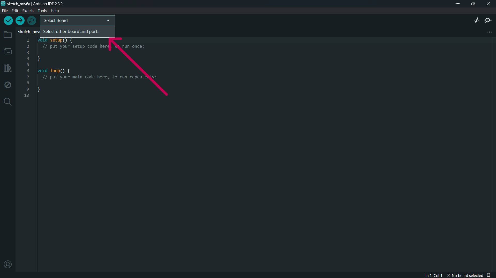
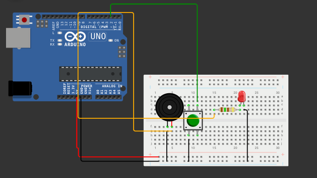

# Botão de Pânico com Arduino

**Descrição:**  
Este tutorial ensinará você a criar um sistema simples de botão de pânico utilizando Arduino. Quando o botão é pressionado, um LED ou buzzer será acionado, simulando um alerta. Este projeto é ideal para iniciantes em eletrônica e programação.

---

## Índice

1. [Introdução](#introdução)  
2. [Requisitos](#requisitos)  
3. [Configuração do Ambiente](#configuração-do-ambiente)  
4. [Montagem do Circuito](#montagem-do-circuito)  
5. [Programação](#programação)  
6. [Testando o Sistema](#testando-o-sistema)  
7. [Melhorias Futuras](#melhorias-futuras)

---

## Introdução  

O objetivo deste projeto é construir um sistema de botão de pânico que emite um alerta sonoro ou visual ao ser pressionado. Isso pode ser utilizado em sistemas de segurança ou como protótipo para projetos maiores.

---

## Requisitos  

- **Atuadores**: Dois leds (Verde: Estado Normal; Vermelho: Estado Emergência);
- **Outros componentes**: Protoboard (fins educacionais), 5 resistores (3 de 330ohms e 2 de 1kohms), jumpers, 1 LCD, cabo usb.
### **Hardware:**  
   - **Placa**: Arduino Uno ou ESP32  
   - **Sensores**: Botão;  
   - **Atuadores**: LED ou Buzzer  
   - **Outros componentes**: Resistor 150Ω, Protoboard e jumpers.
### **Software:**  
- **Linguagens**: C/C++ para Arduino  
- **IDE**: Arduino IDE  
---

## Configuração do Ambiente

### Passo 1: Instalação do Software  

- Baixe e instale a **Arduino IDE** a partir de [arduino.cc](https://www.arduino.cc/en/software).

### Passo 2: Configuração da Placa

1. No Software Arduino Conecte a placa ao computador via USB;
2. Clique em Select other board and port como mostra na imagem abaixo:
   
  
  
3. Selecione a board Arduino Uno;
4. Por fim selecione a porta correta na IDE do Arduino.
   
---

## Montagem do Circuito  

### Conexões:

1. **Botão pulsador**:  
   - Um lado do botão -> Pino digital 2  
   - Outro lado -> GND  
   
2. **LED/Buzzer**:  
   - LED:  
     - Anodo (perna longa) -> Pino digital 9 (com resistor)  
     - Catodo -> GND  
   - Buzzer:  
     - Pino positivo -> Pino digital 9  
     - Pino negativo -> GND  



---

## Programação  

```cpp
const int buttonPin = 2;  // Pino do botão
const int alertaPin = 9;  // Pino do LED ou buzzer

void setup() {
    pinMode(buttonPin, INPUT_PULLUP); // Configura o botão como entrada com pull-up interno
    pinMode(alertaPin, OUTPUT);       // Configura o LED/buzzer como saída
    Serial.begin(9600);
}

void loop() {
    int buttonState = digitalRead(buttonPin);

    if (buttonState == LOW) { // Botão pressionado
        digitalWrite(alertaPin, HIGH); // Liga o LED/buzzer
        Serial.println("Alerta acionado!");
    } else {
        digitalWrite(alertaPin, LOW); // Desliga o LED/buzzer
    }

    delay(100); // Reduz ruído de leitura do botão
}
```

---

## Teste e Validação  

1. **Upload do Código**:  
   Envie o código para a placa clicando no botão **Upload** na IDE do Arduino.  

2. **Monitoramento Serial**:  
   Abra o **Serial Monitor** na IDE (Configuração: 9600 baud).  

3. **Teste do Botão**:  
   Pressione o botão e verifique se o LED/buzzer é acionado e se aparece a mensagem no Serial Monitor.  

---

## Melhorias Futuras  

- Adicionar um módulo Wi-Fi (ESP32) para enviar notificações remotamente.  
- Substituir o LED/buzzer por um display para mensagens de alerta.  
- Integrar um sistema de gravação de eventos com módulo de cartão SD.  

# Referências

1. Link da simulação: https://wokwi.com/projects/414810798576345089
2. Documentação do Arduino: https://www.arduino.cc/.
3. Arduino IDE: https://www.arduino.cc/en/software

---

Este tutorial oferece uma introdução básica para implementar um botão de pânico com Arduino.
