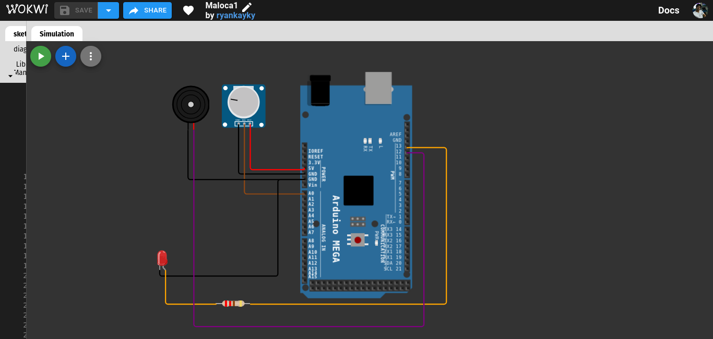

# Circuito Batimentos Cardíacos Usando Arduino Mega

**Descrição:** Neste tutorial, será desenvolvido um sistema de monitoramento de sinais vitais usando um Arduino Mega, com a adaptação de um potenciômetro devido à falta do sensor cardíaco. O objetivo é criar um sistema simples de alerta para monitorar a saúde de um paciente em tempo real. Este projeto visa demonstrar as aplicações de IoT no contexto da saúde, como, por exemplo, o monitoramento da saúde de idosos ou pacientes em casa.

---

## Índice

1. [Introdução](#introdução)
2. [Requisitos](#requisitos)
3. [Configuração do Ambiente](#configuração-do-ambiente)
4. [Montagem do Circuito](#montagem-do-circuito)
5. [Programação](#programação)
6. [Teste e Validação](#teste-e-validação)
7. [Expansões e Melhorias](#expansões-e-melhorias)
8. [Referências](#referências)

---

## Introdução

Este projeto tem como objetivo monitorar a frequência cardíaca de um paciente em tempo real usando a placa Arduino Mega. Com um potenciômetro e um buzzer, o sistema pode emitir alertas visuais e sonoros caso os sinais vitais estejam fora dos limites estabelecidos. A integração com a Internet das Coisas (IoT) permite a coleta de dados e o envio de informações para sistemas remotos, facilitando o acompanhamento de pacientes à distância.

---

## Requisitos

- Buzzer - Para alertas sonoros.
- Jumpers - Fios para conexão.

### Hardware

- **Placa**: Arduino MEGA (ou qualquer modelo compatível).
- **Sensores**: OBS, o potenciômetro é utilizado para simular o sensor de frequência cardíaca KY-039.
- **Atuadores**: LED e Buzzer.
- **Outros componentes**: Jumpers e um resistor de 220 ohms.

### Software

- **Linguagens**: C para Arduino.
- **IDE**: Simulador WOKWI
---

## Configuração do Ambiente

### Passo 1: Utilizando o simulador 

- **WOKWI**: Acesse o site https://wokwi.com/, se não tiver uma conta, crie e faça o login

 

### Passo 2: Criação do projeto

- **Criação do projeto**:Após o login, vá para o seu perfil, acesse a área "My Projects", clique em "New Project" e selecione a placa Arduino Mega ou semelhante.


---

## Montagem do Circuito

**Potenciômetro** (Simulando o sensor de batimentos cardíacos):

    Terminal esquerdo (VCC) → Conecte ao pino 5V do Arduino.
    Terminal direito (GND) → Conecte ao pino GND do Arduino.
    Terminal central (Cursor) → Conecte ao pino A0 (pino analógico) do Arduino.

**LED:**

    Anodo (perna longa) → Conecte ao pino 13 do Arduino (use um resistor de 220Ω a 330Ω em série).
    Catodo (perna curta) → Conecte ao GND do Arduino.

**Buzzer:**

    Pino positivo → Conecte ao pino 12 do Arduino.
    Pino negativo → Conecte ao GND do Arduino.



---

## Programação

### Passo 1: Configuração dos Sensores e Atuadores

Definição das pinogens do LED, Buzzer e Potenciômetro:

**Código em C para Arduino MEGA:**

```cpp
// Configurações do potenciômetro simulando o sensor de frequência cardíaca
const int potPin = A0;  // Pino do potenciômetro (analógico A0)

// Configurações do LED e Buzzer
#define LED_PIN 13
#define BUZZER_PIN 12

void setup() {
  Serial.begin(9600);  // Inicializa a comunicação serial
  
  // Inicialização dos pinos
  pinMode(LED_PIN, OUTPUT);
  pinMode(BUZZER_PIN, OUTPUT);
}
```

### Passo 2: Processamento e Lógica de Alerta

Abaixo está o código que controla o LED, som do buzzer e captura do sinal do potenciômetro:

**Parte lógica do circuito:**

```cpp
void loop() {
  // Leitura do valor analógico do potenciômetro
  int leituraAnalogica = analogRead(potPin);
  
  // Exibir o valor analógico no monitor serial para diagnóstico
  Serial.print("Valor analógico do potenciômetro: ");
  Serial.println(leituraAnalogica);

  // Mapeando a leitura para uma faixa de batimentos cardíacos (por exemplo, 40 a 120 BPM)
  int batimento = map(leituraAnalogica, 0, 1023, 40, 120);  // Mapeia o valor para BPM

  // Exibição dos dados
  Serial.print("Batimentos simulados: ");
  Serial.print(batimento);
  Serial.println(" BPM");

  // Verificação dos limites
  if (batimento > 100 || batimento < 60) {
    digitalWrite(LED_PIN, HIGH);  // Acende o LED
    tone(BUZZER_PIN, 1000);       // Emite som com o buzzer
  } else {
    digitalWrite(LED_PIN, LOW);   // Apaga o LED
    noTone(BUZZER_PIN);           // Desativa o buzzer
  }

  delay(500);  // Atraso de meio segundo para leitura estável
}
```

---

## Teste e Validação

Para verificar o circuito, faça os seguintes cheques de validação:

1. **Verificação da Conexão dos LEDs:** Certifique-se de que os LEDs estão conectados nos pinos corretos e orientados com os terminais certos.
2. **Teste da Sequência:** Salve e execute a simulação pata verificar se possuí algum erro lógico.
3. **Teste do potenciômetro:** Cheque se o potenciômetro está tendos se seus sinais estão sendo lidos corretamentes.

---

## Expansões e Melhorias

Por ser um projeto simples e introdutório, possíveis melhorias seriam:

- Adicionar comunicação Wi-Fi (ESP32) para enviar os dados para a nuvem.
- Integrar um banco de dados para registro e análise das leituras.
- Conectar-se a uma aplicação móvel para visualização remota dos sinais vitais.

---

## Referências

1.Link do sensor cardíaco: https://www.electronicwings.com/
2.Link do simulador: https://wokwi.com/dashboard/projects
3.Link do SPE-32: https://docs.espressif.com/projects/esp-idf/en/latest/esp32/get-started/

---