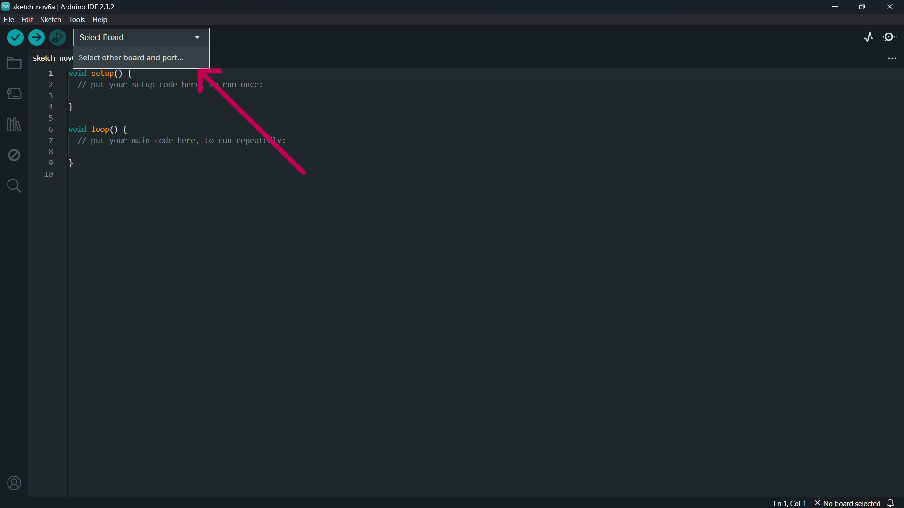

# Verificação de Temperatura Corporal com Alerta

**Descrição:**  
Neste tutorial, você aprenderá a criar um sistema simples para monitorar a temperatura corporal utilizando um Arduino e um sensor de temperatura. Se a temperatura ultrapassar um valor pré-estabelecido, um LED ou buzzer será acionado, alertando para possíveis casos de febre. Este projeto é voltado para iniciantes em eletrônica e programação.

---

## Índice

1. [Introdução](#introdução)  
2. [Requisitos](#requisitos)  
3. [Configuração do Ambiente](#configuração-do-ambiente)  
4. [Montagem do Circuito](#montagem-do-circuito)  
5. [Programação](#programação)  
6. [Testando o Sistema](#testando-o-sistema)  
7. [Melhorias Futuras](#melhorias-futuras)

---

## Introdução  

O objetivo deste projeto é construir um sistema de monitoramento que emita um alerta em caso de temperatura corporal elevada. Isso pode ser útil em cenários médicos ou domésticos para identificar febre de forma rápida e simples.

---

## Requisitos  

### **Hardware:**  
- **Placa**: Arduino Uno ou ESP32  
- **Sensores**: Sensor de temperatura (DHT22 ou DHT11)  
- **Atuadores**: Buzzer ou Led 
- **Outros componentes**:Resistor 330Ω para o LED (caso seja utilizado), resistor de 10kΩ, Protoboard e fios jumpers  

### **Software:**  
- **Linguagens**: C/C++ para Arduindo
- **IDE**: Arduino IDE  
- **Bibliotecas**: DHT22 e DHT sensor library
---

## Configuração do Ambiente

### Passo 1: Instalação do Software

- **Arduino IDE**: Baixe e instale o Arduino IDE a partir do https://www.arduino.cc/en/software.
  

### Passo 2: Configuração da Placa

1. No Software Arduino Conecte a placa ao computador via USB;
2. Clique em Select other board and port como mostra na imagem abaixo:
   
  
  
3. Selecione a board Arduino Uno;
4. Por fim selecione a porta correta na IDE do Arduino.
   
---
## Passo 2: Instalação das bibliotecas

1. No Software Arduino procure a opção tools/ferramentas;
2. Clique em gerenciar bibliotecas:
   
  
3. Intale as bibliotecas: DHT sensor library e DHT22

---


## Montagem do Circuito 

Para montar o circuito, siga as instruções abaixo:

1. Conecte o sensor de temperatura ao microcontrolador:  
   - Para o **DHT22**, conecte:  
     - VCC -> Resistor de 10KΩ -> 5V  
     - GND -> GND  
     - SDA -> Pino digital 2  

2. Conecte o LED/buzzer:
   - LED:  
     - Anodo (perna longa) -> Pino digital 9 (com resistor)  
     - Catodo -> GND  
   - Buzzer:  
     - Pino positivo -> Pino digital 9  
     - Pino negativo -> GND  

3. Use a protoboard para organizar a montagem.


---

## Programação  

```cpp

#include "DHT.h"
#define DHTPIN 2     // Pino onde o sensor está conectado
#define DHTTYPE DHT22 // OU DHT11 para o uso do outro sensor

DHT dht(DHTPIN, DHTTYPE);
const int alertaPin = 9;  // Pino do LED ou buzzer
const float temperaturaLimite = 37.5;  // Limite de temperatura (em °C)

void setup() {
    pinMode(alertaPin, OUTPUT);
    Serial.begin(9600);
    dht.begin();
}

void loop() {
    float temperatura = dht.readTemperature();

    if (isnan(temperatura)) {
        Serial.println("Erro ao ler o sensor!");
        return;
    }

    Serial.print("Temperatura: ");
    Serial.println(temperatura);

    if (temperatura > temperaturaLimite) {
        digitalWrite(alertaPin, HIGH);  // Liga o LED/buzzer
    } else {
        digitalWrite(alertaPin, LOW);  // Desliga o LED/buzzer
    }

    delay(2000);  // Pausa de 2 segundos
}
```

---

## Teste e Validação

Para garantir que o projeto funcione corretamente, realize os seguintes testes:

1. Envie o código para o microcontrolador clicando no botão **Upload** na IDE do Arduino.  
2. Monitore a temperatura no **Serial Monitor** da IDE (Configuração: 9600 baud).  
3. Aumente a temperatura no sensor (toque ou aqueça levemente) e verifique se o LED/buzzer é ativado.  

---

## Expansões e Melhorias

- Substituir o LED/buzzer por uma tela LCD para exibição da temperatura.  
- Conectar o sistema a uma rede Wi-Fi (com ESP32) para enviar notificações.  

---

## Referências

1. Link da simulação: https://wokwi.com/projects/414810798576345089
2. Documentação do Arduino: https://www.arduino.cc/.
3. Arduino IDE: https://www.arduino.cc/en/software

---

Este tutorial fornece uma introdução básica ao controle de sensores com Arduino.