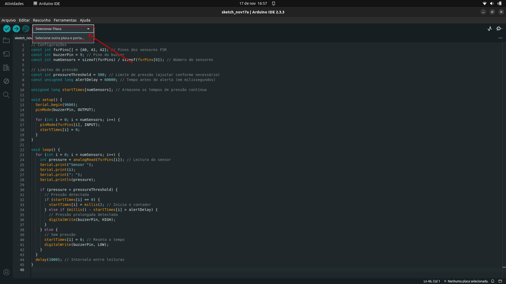

# Sensor de Postura para Pacientes Acamados

**Descrição:** Neste tutorial, vamos desenvolver um sistema de monitoramento de postura para pacientes acamados utilizando um Arduino e sensores de pressão. O objetivo é identificar pressões prolongadas em áreas críticas, ajudando a prevenir úlceras por pressão e desconforto. Este projeto é ideal para estudantes e profissionais da área de tecnologia e saúde interessados em criar soluções inovadoras para o bem-estar de pacientes. 

---

## Índice

1. [Introdução](#introdução)
2. [Requisitos](#requisitos)
3. [Configuração do Ambiente](#configuração-do-ambiente)
4. [Montagem do Circuito](#montagem-do-circuito)
5. [Programação](#programação)
6. [Teste e Validação](#teste-e-validação)
7. [Expansões e Melhorias](#expansões-e-melhorias)
8. [Referências](#referências)

---

## Introdução

Pacientes acamados por longos períodos estão sujeitos ao risco de desenvolver úlceras por pressão e desconforto devido à permanência em uma mesma posição. Este projeto visa criar um sistema que monitora a pressão exercida em diferentes áreas de um colchão usando sensores resistivos de força (FSR). Caso uma pressão inadequada seja detectada por muito tempo, um alerta sonoro é acionado para notificar os cuidadores.

---

## Requisitos

### Hardware

- **Placa**: Arduino Uno ou Mega;
- **Sensores**: 3-5 Sensores FSR (Resistive Force Sensor) ou sensores de pressão similares;
- **Atuadores**: Buzzer;
- **Outros componentes**: Jumpers, resistores 10kΩ, Protoboard, Fonte de alimentação (cabo USB ou bateria).

### Software

- **Linguagens**: C/C++ para Arduino;
- **IDE**: Arduino IDE;
- **Biblioteca Opcional**: Tone (para sons personalizados com o buzzer).

---

## Configuração do Ambiente

### Passo 1: Instalação do Software

- **Arduino IDE:** Baixe e instale o Arduino IDE a partir do https://www.arduino.cc/en/software.

- **Instalar bibliotecas do Tone**

    

### Passo 2: Configuração das Placas

1. Certifique-se de que a placa Arduino está conectada ao computador.
2. Clique em Select other board and port como mostra na imagem abaixo:
   
  
  
3. Selecione a board Arduino Uno or Mega;
4. Na IDE, configure a porta correta (Ferramentas > Porta).
5. Carregue o código básico para verificar a comunicação com a placa.

---

## Montagem do Circuito

Esquema do Circuito
1. Sensores FSR:
- Conecte uma extremidade do FSR ao VCC (5V).
- Conecte a outra extremidade ao GND via um resistor de 10kΩ.
- Faça uma derivação do ponto entre o FSR e o resistor para um pino analógico no Arduino (ex.: A0, A1, A2...).
2. Buzzer:
- Terminal positivo → Pino digital.
- Terminal negativo → GND.
3. Conexão Resumida:
- Cada sensor FSR será ligado a um pino analógico do Arduino.
- O buzzer será conectado a um pino digital. 

    

---

## Programação

### Passo 1: Configuração dos Sensores e Atuadores

Definiremos os pinos dos sensores FSR e o pino do Buzzer, e os configuraremos como saídas para controlar o estado de cada sensor e o buzzer para o alerta:

**Código Arduino:**

```cpp
// Configurações
const int fsrPins[] = {A0, A1, A2}; // Pinos dos sensores FSR
const int buzzerPin = 9; // Pino do buzzer
const int numSensors = sizeof(fsrPins) / sizeof(fsrPins[0]); // Número de sensores

// Limites de pressão
const int pressureThreshold = 200; // Limite de pressão (ajustar conforme necessário)
const unsigned long alertDelay = 1000; // Tempo antes do alerta (em milissegundos)

unsigned long startTimes[numSensors]; // Armazena os tempos de pressão contínua

void setup() {
  Serial.begin(9600);
  pinMode(buzzerPin, OUTPUT);

  for (int i = 0; i < numSensors; i++) {
    pinMode(fsrPins[i], INPUT);
    startTimes[i] = 0;
  }
}
```

### Passo 2: Processamento e Lógica de Alerta

Implemente a lógica para processar as leituras dos sensores e ativar o buzzer caso os valores de pressão ultrapassem um limite predefinido por um período prolongado.

**Código Arduino:**
```cpp
void loop() {
  for (int i = 0; i < numSensors; i++) {
    int pressure = analogRead(fsrPins[i]); // Leitura do sensor
    Serial.print("Sensor ");
    Serial.print(i);
    Serial.print(": ");
    Serial.println(pressure);

    if (pressure > pressureThreshold) {
      // Pressão detectada
      if (startTimes[i] == 0) {
        startTimes[i] = millis(); // Inicia o contador
      } else if (millis() - startTimes[i] > alertDelay) {
        // Pressão prolongada detectada
        digitalWrite(buzzerPin, HIGH);
      }
    } else {
      // Sem pressão
      startTimes[i] = 0; // Reseta o tempo
      digitalWrite(buzzerPin, LOW);
    }
  }
  delay(1000); // Intervalo entre leituras
}
```
---

## Teste e Validação

- **Upload do código**: Conecte o Arduino ao computador e carregue o código e monitore os sensores no Monitor Serial para garantir leituras corretas.

- **Teste do sistema**: Simule diferentes pressões nas áreas monitoradas e verifique se o buzzer é acionado após o tempo limite configurado.

- **Ajustes finais**: Ajuste os valores do `pressureThreshold` e do `alertDelay` conforme necessário e certifique-se de que o sistema não gera falsos positivos.

---

## Expansões e Melhorias

Sugestões para melhorar o projeto, como:

- **Interface de visualização**: Adicione um display LCD ou um módulo Wi-Fi (como o ESP8266) para exibir os dados em tempo real ou enviá-los para um aplicativo móvel.

- **Monitoramento remoto**: Integre o sistema com plataformas IoT (ThingSpeak) para que os dados possam ser acessados por profissionais de saúde remotamente.

- **Controle de relé**: Automatize o ajuste de colchões ou almofadas pneumáticas para redistribuir a pressão automaticamente.

- **Alertas personalizados**: Configure diferentes sons para o buzzer ou notificações por mensagens.

---

## Referências

1. **Documentação do Arduino**: <https://www.arduino.cc>
2. **Link da simulação**: <https://www.tinkercad.com/things/jRamFotlnNj-sensor-de-postura-para-pacientes-acamados>
3. **Documentação do Adafruit sobre FSR**: <https://learn.adafruit.com/force-sensitive-resistor-fsr>

---

Este tutorial fornece uma introdução prática ao uso de sensores de pressão com Arduino, simulando um sistema de monitoramento de postura para pacientes acamados em ambientes de saúde.
