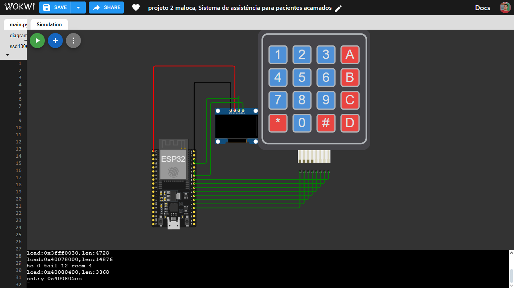

# Sistema de Comunicação para Paciente Acamado com Teclado e Display LCD

**Descrição:** Neste tutorial, vamos desenvolver um sistema de comunicação para pacientes acamados utilizando um ESP32, um teclado matricial 4x4 e um display LCD SSD1306. O sistema permite que o paciente solicite assistência para diferentes situações, como chamar a enfermeira, pedir água ou ajustar a temperatura do ambiente.

---

## Índice

1. [Introdução](#introdução)
2. [Requisitos](#requisitos)
3. [Configuração do Ambiente](#configuração-do-ambiente)
4. [Montagem do Circuito](#montagem-do-circuito)
5. [Programação](#programação)
6. [Teste e Validação](#teste-e-validação)
7. [Expansões e Melhorias](#expansões-e-melhorias)
8. [Referências](#referências)

---

## Introdução

O objetivo deste projeto é criar um sistema simples para um paciente acamado interagir com o ambiente ao seu redor, utilizando um teclado e um display LCD. O paciente poderá chamar a enfermeira, pedir água, pedir refeição, ajustar a temperatura, entre outras ações. A interface é controlada através de um teclado matricial, e as respostas são exibidas em um display LCD de 128x64.



[Link da simulação](https://wokwi.com/projects/417000215354529793)

---

## Requisitos

### Hardware

- **Placa**: ESP32
- **Teclado Matricial 4x4**: Usado para capturar as entradas do paciente.
- **Display LCD SSD1306 (128x64)**: Para exibir as opções e mensagens de interação com o paciente.
- **Jumpers**: Para as conexões entre o ESP32 e os periféricos.
- **Fonte de Alimentação**: Para o ESP32.

### Software

- **Linguagem**: MicroPython
- **IDE**: Thonny (para ESP32 com MicroPython)
- **Bibliotecas**:
  - `ssd1306`: Para controlar o display LCD.
  - `machine`: Para interagir com os pinos do ESP32.
  - `time`: Para gerenciamento de tempo.

---

## Configuração do Ambiente

### Passo 1: Instalação do Software

- **Thonny**: Baixe e instale a IDE Thonny para programar o ESP32.
- **Bibliotecas**: Instale a biblioteca `ssd1306` para o display LCD no ambiente de desenvolvimento.

```bash
# Instalar a biblioteca SSD1306 para o display LCD
pip install adafruit-circuitpython-ssd1306 
```
## Passo 2: Configuração das Placas

### ESP32
Conecte o ESP32 ao seu computador e selecione a porta correta na IDE Thonny.

### Teclado Matricial
Conecte as linhas e colunas do teclado aos pinos do ESP32.

### Display LCD
Conecte o display LCD aos pinos SDA e SCL do ESP32.

## Montagem do Circuito

**Nota:** As conexões principais são:

### Teclado:
- Linhas (pinos 2, 0, 4, 16) conectados a cada linha do teclado.
- Colunas (pinos 17, 5, 18, 19) conectados a cada coluna do teclado.

### Display LCD:
- Conectar os pinos SDA e SCL aos pinos 21 e 22 do ESP32, respectivamente.

## Programação

### Passo 1: Configuração do Teclado e Display
No código, as opções para o paciente são exibidas no display LCD, e o teclado matricial é escaneado para detectar as entradas.

```python
from machine import Pin, I2C
import time
import ssd1306

# Definir pinos para o teclado
linhas = [Pin(2, Pin.OUT), Pin(0, Pin.OUT), Pin(4, Pin.OUT), Pin(16, Pin.OUT)]
colunas = [Pin(17, Pin.IN, Pin.PULL_UP), Pin(5, Pin.IN, Pin.PULL_UP), Pin(18, Pin.IN, Pin.PULL_UP), Pin(19, Pin.IN, Pin.PULL_UP)]

# Mapeamento do teclado
teclas = [
    ['1', '2', '3', 'A'],
    ['4', '5', '6', 'B'],
    ['7', '8', '9', 'C'],
    ['*', '0', '#', 'D']
]

# Inicializar I2C para o display LCD
i2c = I2C(0, scl=Pin(22), sda=Pin(21), freq=400000)
lcd = ssd1306.SSD1306_I2C(128, 64, i2c)

# Função para escanear o teclado
def escanear_teclado():
    for i in range(4):
        linhas[i].value(0)
        for coluna_num in range(4):
            if not colunas[coluna_num].value():
                for linha_num in range(4):
                    linhas[linha_num].value(1)
                return teclas[i][coluna_num]
        linhas[i].value(1)
    return None

# Função para exibir mensagens no LCD
def exibir_mensagem(mensagem):
    lcd.fill(0)
    lcd.text(mensagem, 0, 0)
    lcd.show()

# Menu principal
def menu_principal(grupo):
    lcd.fill(0)
    if grupo == 1:
        lcd.text("1. Chamar Enfermeira", 0, 0)
        lcd.text("2. Pedir Agua", 0, 10)
        lcd.text("3. Ajustar Temp.", 0, 20)
        lcd.text("4. Pedir Refeicao", 0, 30)
        lcd.text("5. Chamar Medico", 0, 40)
    elif grupo == 2:
        lcd.text("6. Pedir Medicamento", 0, 0)
        lcd.text("7. Ajustar Cama", 0, 10)
        lcd.text("8. Trocar Roupa", 0, 20)
        lcd.text("9. Pedir Ajuda", 0, 30)
        lcd.text("10. Controlar Luz", 0, 40)
    
    lcd.text("A: Proximo | B: Voltar", 0, 50)
    lcd.show()
```
## Passo 2: Navegação no Menu
Usamos os botões A e B para alternar entre dois grupos de opções no menu, com cada grupo exibindo 5 opções.

## Teste e Validação

- **Testando o Teclado:** Certifique-se de que todas as teclas do teclado matricial respondem corretamente.
- **Validação do Display:** Verifique se todas as opções são exibidas corretamente no display LCD.
- **Interação com o Paciente:** Teste o sistema inteiro para garantir que as entradas sejam processadas e as respostas sejam exibidas corretamente no display.

## Expansões e Melhorias

- **Integração com Sistema de Alarme:** Adicione um sistema de alarme sonoro ou visual para alertar os cuidadores.
- **Conexão Wi-Fi:** Utilize a conectividade Wi-Fi do ESP32 para enviar dados de solicitações para uma plataforma de monitoramento.
- **Tela de Toque:** Substitua o teclado físico por uma tela de toque para maior facilidade de uso.

## Referências

- [ESP32 MicroPython Documentation](https://docs.micropython.org/)
- [Biblioteca SSD1306 para MicroPython](https://docs.arduino.cc/libraries/adafruit-ssd1306/)
