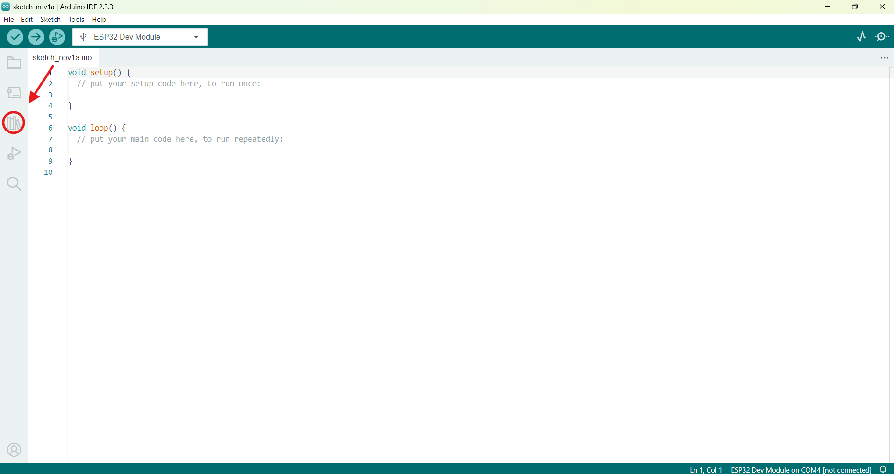
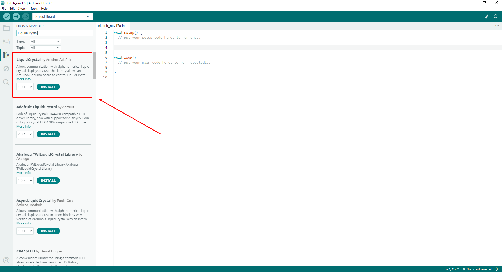
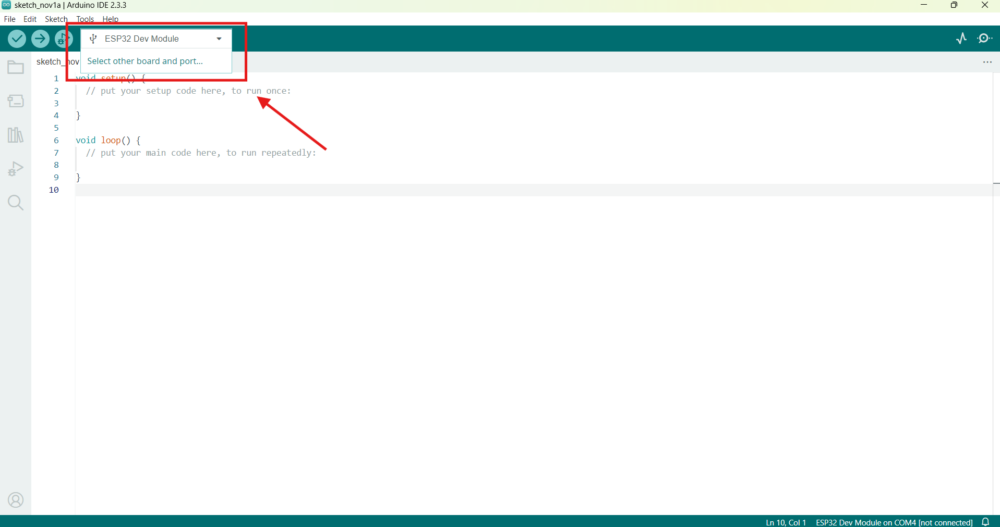
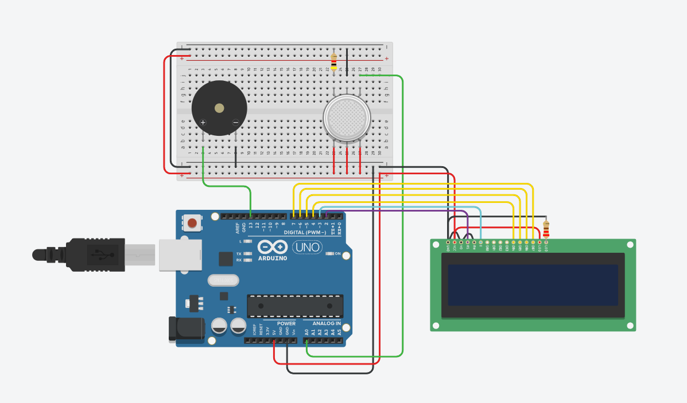

# Sistema de Monitoramento de Qualidade do Ar com Arduino

**Descrição:** Criação de um circuito utilizando Arduino Uno e o sensor MQ-135 para monitorar a qualidade do ar e indicar níveis críticos por meio de um alerta visual e sonoro.

---

## Índice

1. [Introdução](#introdução)
2. [Requisitos](#requisitos)
3. [Configuração do Ambiente](#configuração-do-ambiente)
4. [Montagem do Circuito](#montagem-do-circuito)
5. [Programação](#programação)
6. [Teste e Validação](#teste-e-validação)
7. [Expansões e Melhorias](#expansões-e-melhorias)
8. [Referências](#referências)

---

## Introdução
Este projeto utiliza o sensor MQ-135 para medir a qualidade do ar, exibindo os dados em um display LCD 16x2 e acionando alertas visuais e sonoros para níveis críticos de poluição. O sistema é voltado para aplicações em **saúde pública**, auxiliando na prevenção de doenças respiratórias e na identificação de ambientes potencialmente perigosos.

---

## Requisitos

### Hardware

- **Placa:** Arduino Uno;
- **Sensores:** MQ-135 (sensor de gás);
- **Atuadores:**
  - Buzzer (alarme sonoro);
- **Display:** LCD 16x2 (com ou sem módulo I2C);
- **Outros componentes:**
  - Protoboard;
  - Resistores de 220 ohms e 4k ohm;
  - Cabo USB;
  - Cabos jumpers.

### Software

- **Linguagens**: C para Arduino via Arduino IDE;
- **IDE**: Arduino IDE, Tinkercad (Opcional);
- **Bibliotecas**: LiquidCrystal (LCD).

---

## Configuração do Ambiente

### Passo 1: Instalação do Software

1. Faça o download e instale a [Arduino IDE](https://www.arduino.cc/en/software);
   
2. Após instalar o Arduino IDE, certifique-se de que a biblioteca **LiquidCrystal** está instalada:
   - Na Arduino IDE, abra o **Library Manager**;


   - Pesquise por `LiquidCrystal` e clique em **Instalar**.


### Passo 2: Configuração da Placa

1. Conecte o Arduino UNO ao computador via cabo USB;
2. Na Arduino IDE:
   - Clique em Select other board and port;
     
   - Selecione a board Arduino UNO.
   - Por fim selecionar a Porta.

---

## Montagem do Circuito

 - Monte o circuito conforme as conexões abaixo. Utilize uma protoboard para organizar os componentes.
   

### **Conexões**
#### Sensor MQ-135
- **AOUT** → Pino A0 do Arduino;
- **VCC** → 5V;
    - Todos os 3 podem ser ligados ao positivo da protoboard(VCC)
- **GND** → GND;
    - 1 pino conectado a protobard no negativo(GND)
    - 1 pino conectado ao resistor de 4k ohm que passa para a protobard no negativo(GND)

#### Display LCD
- **RS** → Pino 2 digital do arduino;
- **E** → Pino 3 digital do arduino;
- **D4, D5, D6, D7** → Pinos 4, 5, 6, 7(todos pinos digitais);
- **VSS e RW** → GND;
- **VDD** → 5V;

#### Buzzer
- **Pino Positivo (Buzzer)** → Pino 13 digital do arduino;
- **GND (Buzzer)** → GND.

---

## Programação

### Passo 1: Configuração do LCD
- Com o circuito montado, vamos configurar o LCD no Arduino IDE:
```cpp
#include <LiquidCrystal.h>

// Definição dos pinos do LCD
#define D7 7
#define D6 6
#define D5 5
#define D4 4
#define E 3
#define RS 2

LiquidCrystal lcd(RS, E, D4, D5, D6, D7);
```
### Passo 2: Configuração dos pinos do buzer e sensor MQ:
```cpp
// Pino do sensor MQ-135
const int MQ135_PIN = A0;

// Pino do buzzer
const int BUZZER_PIN = 13;

```
### Passo 3: Configurações das funções para checagem da qualidade do ar:
```cpp
// Limites para qualidade do ar
const int LIMITE_BOM = 300;     // Boa: abaixo de 300
const int LIMITE_MODERADO = 400; // Moderada: entre 300 e 400
const int LIMITE_RUIM = 500; // Moderada: entre 400 e 500

// Função para determinar a qualidade do ar
String qualidadeDoAr(int valor) {
  if (valor < LIMITE_BOM) return "Boa";
  else if (valor < LIMITE_MODERADO) return "Moderada";
   else if (valor > LIMITE_MODERADO && valor < LIMITE_RUIM) return "Ruim";
  else return "Pessimo";
}
```
### Passo 4: Lógica do recebimento e exibição dos avisos: 
```cpp
//configuração inicial do arduino para LCD, pinos e monitor serial.
void setup() {
  // Configuração do LCD
  lcd.begin(16, 2);

  // Configuração dos pinos
  pinMode(BUZZER_PIN, OUTPUT);

  // Mensagem inicial no LCD
  lcd.setCursor(0, 0);
  lcd.print("Inicializando...");
  delay(2000);
  lcd.clear();

  // Inicializar o monitor serial
  Serial.begin(9600);
}

//looping de recebimento e processamento dos dados recebidos pelo sensor.
void loop() {
  // Ler o valor analógico do sensor MQ-135
  int valorDoSensor = analogRead(MQ135_PIN);

  // Determinar a qualidade do ar
  String qualidadeAr = qualidadeDoAr(valorDoSensor);

  // Atualizar LCD com os valores
  lcd.clear();
  lcd.setCursor(0, 0);
  lcd.print("Valor: ");
  lcd.print(valorDoSensor);

  lcd.setCursor(0, 1);
  lcd.print("Status: ");
  lcd.print(qualidadeAr);

  // Exibir os valores no monitor serial
  Serial.print("Valor do sensor: ");
  Serial.print(valorDoSensor);
  Serial.print(" - Qualidade: ");
  Serial.println(qualidadeAr);

  // Controle do buzzer
  if (qualidadeAr == "Pessimo") {
    digitalWrite(BUZZER_PIN, HIGH); // Ativa buzzer
  } else {
    digitalWrite(BUZZER_PIN, LOW);  // Desativa buzzer
  }

  delay(2000); // Atualização a cada 2 segundos
}
```

## Teste e Validação

1. **Testando Atuadores**: Verifique que os valores coletados pelo sensor está aparecendo no LCD;
2. **Validação dos Sensores**: Confirme que aos valores recebidos exibidos tanto no monitor serial quando no LCD condizem com os recebidos;
3. **Monitoramento em Tempo Real**: Teste o sistema completo em condições simuladas para garantir que funciona conforme o esperado.
4. **Estado Normal**: Verifique se após um intervalo de tempo os valores estão sendo atualizados. 

---

## Expansões e Melhorias

- Modulo ESP32 para comunicação WIFI com algum dispositivo móvel e com sistemas em núvem, permitindo armazenar os valores captados e até mesmo agir de forma preveentiva;
- Integrar um banco de dados para registro das leituras;
- Adição de sensor de umidade para melhor análise da qualidade do ar.

---

## Referências

1. https://www.tinkercad.com/things/2IbGbmv7U5O-sensor-de-qualidade-do-armq135?sharecode=JQ-L7VImIFC5fJLznSNaKpj84FpDoL0Iiw2BHIfK4x4
2. https://docs.arduino.cc/libraries/liquidcrystal/
3. https://www.arduino.cc/en/software


