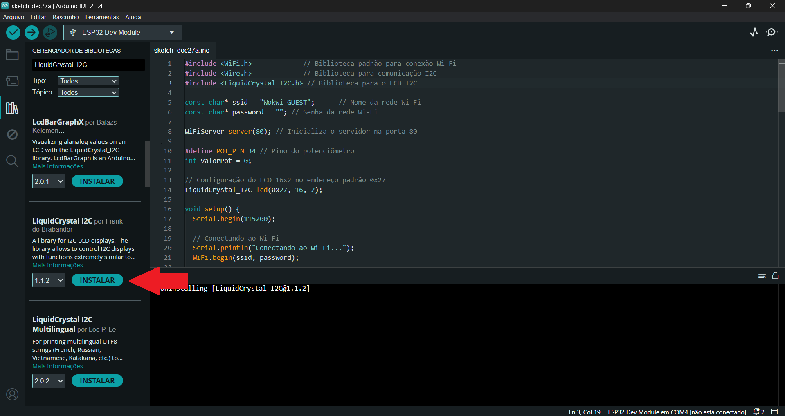
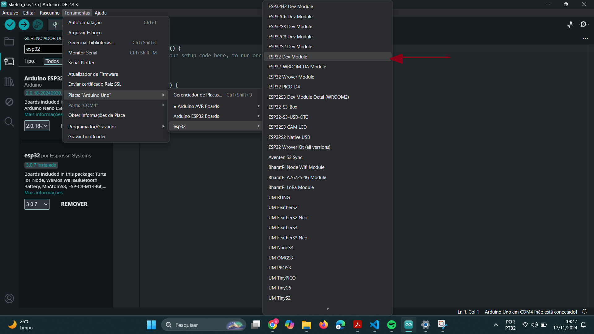
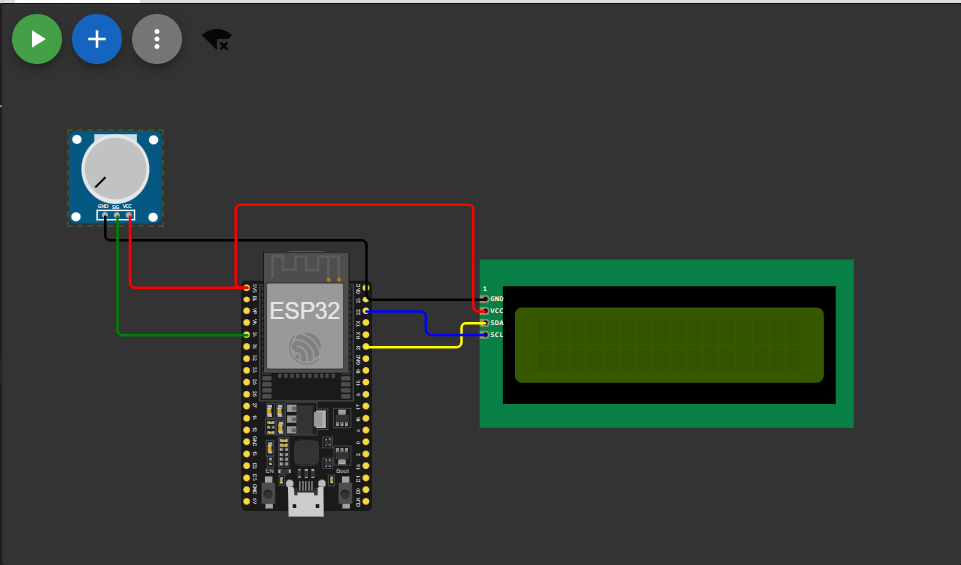

# Sistema de Monitoramento de Pacientes em Períodos Pós-Operatórios

**Descrição:** Este tutorial demostra os passos para a criação de um projeto que simula a coleta de dados de frequência cardíaca (BPM) e oxigenação do sangue (SpO2) utilizando um potenciômetro conectado a um ESP32. Os valores simulados são exibidos em um LCD 16x2 e disponibilizados em um servidor web acessível via navegador.
 
---

## Índice

- [Sistema de Monitoramento de Pacientes em Períodos Pós-Operatórios](#sistema-de-monitoramento-de-pacientes-em-períodos-pós-operatórios)
  - [Índice](#índice)
  - [Introdução](#introdução)
  - [Requisitos](#requisitos)
    - [Hardware](#hardware)
    - [Software](#software)
  - [Configuração do Ambiente](#configuração-do-ambiente)
    - [Passo 1: Instalação do Software](#passo-1-instalação-do-software)
    - [Passo 2: Configuração das Placas](#passo-2-configuração-das-placas)
  - [Montagem do Circuito](#montagem-do-circuito)
  - [Programação](#programação)
    - [Passo 1: Configuração dos Sensores e Atuadores](#passo-1-configuração-dos-sensores-e-atuadores)
    - [Passo 2: Processamento e Lógica de Alerta](#passo-2-processamento-e-lógica-de-alerta)
  - [Teste e Validação](#teste-e-validação)
  - [Expansões e Melhorias](#expansões-e-melhorias)
  - [Referências](#referências)

---

## Introdução

Monitorar sinais vitais como frequência cardíaca e oxigenação é fundamental no cuidado de pacientes no período pós-operatório. Estas métricas ajudam a identificar possíveis complicações, como hipóxia ou arritmias, que podem colocar o paciente em risco.

Este projeto demonstra como criar uma solução básica que combina hardware IoT e exibição local de dados em um LCD, além de oferecer acesso remoto via servidor web. Apesar da simplicidade, a estrutura pode ser expandida para incluir sensores reais e funcionalidades mais avançadas.

---

## Requisitos

### Hardware

- **Placa**: ESP32
- **Sensores**: Potenciômetro que sumilará o Sensor MAX30102.
- **Outros componentes**: LCD 16x2 com módulo I2C, Jumpers, protoboard(Opcional).

### Software

- **Linguagens**: C/C++ para ESP32
- **IDE**: Arduino IDE
- **Bibliotecas**: LiquidCrystal_I2C, WiFi e Wire(Normalmente já vem instalada)

---

## Configuração do Ambiente

### Passo 1: Instalação do Software

- **Arduino IDE**: Por meio do link (https://www.arduino.cc/en/software) instale a IDE do Arduino. Após a instalação em Gerenciamento de Placas pesquise ESP32 e instale o item de mesmo nome. 

- **Bibliotecas**: No Gerenciador de bibliotecas, pesquise por LiquidCrystal I2C e instale a opção de mesmo nome. Faça o mesmo com a biblioteca WiFi.

    


### Passo 2: Configuração das Placas

1. Conecte a ESP32 ao computador usando o cabo micro-USB.
2. No arduino IDE em Ferramentas > Placa > esp32, selecione ESP32 Dev Module.
    
    

3. Faça um processo parecido para selecionar a porta em Ferramentas > Portas e selecione a correspondente. 
 
---

## Montagem do Circuito

As principais ligações a serem feitas no circuito do sistema são:

Ligações com o LCD:
1. Conectar o VCC do LCD com a alimentação 3.3V do ESP32;
2. Conectar o GND do LCD com a alimentação negativa da placa;
3. Conectar o SDA do LCD com a GPIO21 do ESP32;
4. Conectar o SCL do sensor com a GPIO22 do ESP32;

Ligações com o Potenciômetro:
1. Conectar o terminal central do potenciômetro com a GPIO34 do ESP32;
2. Conectar o terminal direito do potenciômetro com a alimentação 3.3V do ESP32;
3. Conectar o terminal esquerdo do potenciômetro com a alimentação negativa da placa;

- A imagem a seguir ilustra melhor as ligações a serem feitas.
        
    

---

## Programação

### Passo 1: Configuração dos Sensores e Atuadores

Com o circuito pronto, agora partiremos para a programação lógica do circuito.

```cpp
#include <WiFi.h>             // Biblioteca padrão para conexão Wi-Fi
#include <Wire.h>             // Biblioteca para comunicação I2C
#include <LiquidCrystal_I2C.h> // Biblioteca para o LCD I2C

const char* ssid = "Wokwi-GUEST";      // Nome da rede Wi-Fi
const char* password = ""; // Senha da rede Wi-Fi

WiFiServer server(80); // Inicializa o servidor na porta 80

#define POT_PIN 34 // Pino do potenciômetro
int valorPot = 0;  // Variável utilizada para coletar os valores do potenciômetro

// Configuração do LCD 16x2 no endereço padrão 0x27
LiquidCrystal_I2C lcd(0x27, 16, 2);

void setup() {
  Serial.begin(115200); //Inicializa o monitor serial para informa se a conexão foi estabelecida com sucesso
  
  // Conectando ao Wi-Fi
  Serial.println("Conectando ao Wi-Fi...");
  WiFi.begin(ssid, password);

  while (WiFi.status() != WL_CONNECTED) {
    delay(1000);
    Serial.print(".");
  }

  Serial.println("\nWi-Fi Conectado!");
  Serial.print("Endereço IP: ");
  Serial.println(WiFi.localIP()); // Mostra o IP do ESP32

  server.begin(); // Inicia o servidor

  // Configuração do LCD
  lcd.init();
  lcd.backlight();
  lcd.setCursor(0, 0);
  lcd.print("Monitor Online");
  delay(2000);
}
```

### Passo 2: Processamento e Lógica de Alerta

- Segunda parte do código

```cpp
void loop() {
  // Lê o valor do potenciômetro
  valorPot = analogRead(POT_PIN);
  float bpm = map(valorPot, 0, 4095, 40, 120); // Simula frequência cardíaca
  float spo2 = map(valorPot, 0, 4095, 85, 100); // Simula oxigenação

  // Atualiza o display LCD
  lcd.clear();
  lcd.setCursor(0, 0);
  lcd.print("BPM: ");
  lcd.print(bpm);
  lcd.setCursor(0, 1);
  lcd.print("SpO2: ");
  lcd.print(spo2);
  lcd.print("%");
  delay(1000); // Atualiza a cada segundo

  // Processa requisições de clientes
  WiFiClient client = server.available();
  if (client) {
    Serial.println("Cliente conectado");
    String request = client.readStringUntil('\r'); // Lê a solicitação HTTP
    Serial.println(request);

    // Envia uma resposta para o cliente
    client.println("HTTP/1.1 200 OK");
    client.println("Content-Type: text/html");
    client.println("Connection: close");
    client.println();
    client.println("<!DOCTYPE HTML>");
    client.println("<html>");
    client.println("<h1>Monitoramento Pós-Operatório</h1>");
    client.print("<p>BPM: ");
    client.print(bpm);
    client.println("</p>");
    client.print("<p>SpO2: ");
    client.print(spo2);
    client.println("%</p>");
    client.println("</html>");
    client.stop();
    Serial.println("Cliente desconectado");
  }
}
```

---

## Teste e Validação

Possíveis teste a serem feitos para garantir a funcionalidade do projeto:

1. **Testando Conexões**: Verifique se os jumpers estão corretamente conectados entre o LCD, potenciômetro e o ESP32. 
2. **Validação do Sensor**: Testar se os dados do potenciômetro estão sendo lidos corretamente, com pequenos movimentos e mostrados no LCD.
3. **Validações Finais**: Abra o Monitor Serial e copie o endereço IP exibido e insira o IP no navegador para visualizar os dados remotamente.

---

## Expansões e Melhorias

Sugestões para melhorar o projeto, como:

- Substituir o potenciômetro por sensores reais, como o MAX30102, para medir BPM e SpO2.
- Adicionar um módulo de armazenamento para salvar os dados capturados.
- Integrar o sistema com um aplicativo de monitoramento ou banco de dados online.

---

## Referências

1. (https://www.circuitschools.com/interfacing-16x2-lcd-module-with-esp32-with-and-without-i2c/)
2. (https://wokwi.com/projects/418354590551289857)
3. (https://microcontrollerslab.com/esp32-heart-rate-pulse-oximeter-max30102/)
4. (https://www.msdmanuals.com/pt/profissional/t%C3%B3picos-especiais/cuidados-dos-pacientes-cir%C3%BArgicos/cuidados-p%C3%B3s-operat%C3%B3rios)

---