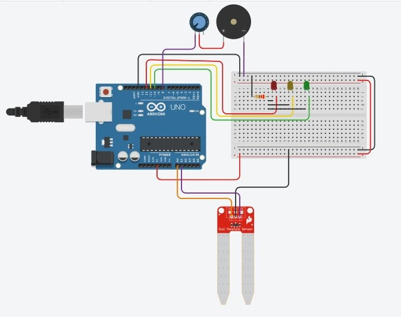

# Projeto de Monitoramento de Hidratação para Pacientes Acamados - Maloca das iCoisas

## Descrição
Neste tutorial, vamos desenvolver um sistema de monitoramento de nível de líquido utilizando um sensor de umidade, com acionamento de LEDs e buzzer, usando uma placa **Arduino**. O objetivo é criar um sistema que detecte o nível de líquido e forneça alertas visuais e sonoros em tempo real. Este projeto é ideal para iniciantes e tem foco em automação de ambientes e sistemas de monitoramento. Aplicado à área da saúde, o sistema foi idealizado para monitorar o nível de líquidos, como soro ou água, administrados ao paciente. Ele pode emitir um alerta quando o nível do líquido estiver prestes a acabar, garantindo que os profissionais de saúde sejam notificados de forma rápida e eficaz.

## Índice
1. [Introdução](#introdução)
2. [Requisitos](#requisitos)
   - [Hardware](#hardware)
   - [Software](#software)
3. [Configuração do Ambiente](#configuração-do-ambiente)
4. [Montagem do Circuito](#montagem-do-circuito)
5. [Programação](#programação)
   - [Configuração dos Sensores e Atuadores](#configuração-dos-sensores-e-atuadores)
   - [Processamento e Lógica de Alerta](#processamento-e-lógica-de-alerta)
6. [Teste e Validação](#teste-e-validação)
7. [Expansões e Melhorias](#expansões-e-melhorias)
8. [Referências](#referências)

---

## Introdução

Este projeto tem como objetivo a construção de um sistema de monitoramento de nível de líquido, como água ou soro, utilizando um sensor de umidade. O sistema utiliza LEDs para indicar os níveis de líquido e um buzzer para emitir alertas quando o nível atingir valores críticos. O projeto integra a automação no ambiente e pode ser expandido para outros sistemas de monitoramento, como controle de umidade e temperatura.

---

## Requisitos


### Hardware

- **Placa**: Arduino Uno (ou similar)
- **Sensor**: Sensor de umidade (moisture sensor)
- **Atuadores**: LEDs (para diferentes níveis de líquido), Buzzer (para alerta sonoro)
- **Outros componentes**:
  - Potenciômetro (para controle do volume do buzzer)
  - Jumpers
  - Resistor 220 ohms (para limitar a corrente dos LEDs)
  - Fonte de alimentação (se necessário)
  - Placa de prototipagem (breadboard)

### Software

- **Linguagens**:
  - C/C++ (Arduino)
- **IDE**:
  - Arduino IDE
- **Bibliotecas**:
  - Nenhuma biblioteca externa necessária para este projeto específico.

---

## Configuração do Ambiente

### Passo 1: Instalação do Software

- **Arduino IDE**:  
  Baixe e instale a IDE do Arduino [aqui](https://www.arduino.cc/en/software). Certifique-se de que a IDE está configurada para sua placa **Arduino Uno**.

### Passo 2: Configuração das Placas

- **Arduino**:  
  No Arduino IDE, selecione a placa correta (Arduino Uno) em **Ferramentas > Placa > Arduino Uno** e configure a porta de comunicação correta.

   

---

## Montagem do Circuito

A montagem do circuito é bem simples. Conecte o sensor de umidade aos pinos analógicos do Arduino e os LEDs e buzzer aos pinos digitais.

- **Sensor de umidade**:  
  Conecte o pino de leitura analógica do sensor ao pino A1 do Arduino.
  
- **LEDs**:  
  Conecte três LEDs aos pinos digitais 10, 11 e 12 do Arduino. Cada LED representará um nível de líquido (baixo, médio, alto).

- **Buzzer**:  
  Conecte o buzzer ao pino digital 8 para emitir um som quando o nível de líquido estiver baixo.
  
- **Potenciômetro**:  
  Conecte o potenciômetro ao pino analógico A0 do Arduino para controlar o volume do buzzer.

```plaintext
Pinos Arduino -> Componentes
A0    -> VCC do sensor de umidade
GND   -> GND do sensor de umidade
A1    -> Pino de leitura do sensor de umidade
pino positivo no pino do meio do potenciomentro    -> Buzzer
D10   -> LED alto
D11   -> LED médio
D12   -> LED baixo
D8    -> Potenciômetro (controle de volume)
```
 

## Programação

Aqui está o código para programar o Arduino para ler o nível de líquido e acionar os LEDs e buzzer conforme o nível:

```cpp
// Definindo pinos do sensor e dos alertas
#define NIVEL_PIN A1      // Sensor de nível de líquido
#define LED_ALTO 10       // LED para nível alto
#define LED_MEDIO 11      // LED para nível médio
#define LED_BAIXO 12      // LED para nível baixo
#define BUZZER_PIN 8      // Buzzer para alerta sonoro
#define POWER_PIN A0      // Pino de energia do sensor

int nivelLiquido = 0;
bool buzzerLigado = false;  // Variável para controlar o estado do buzzer

void setup() {
  // Configurações de pinos
  pinMode(POWER_PIN, OUTPUT);
  pinMode(NIVEL_PIN, INPUT);
  pinMode(LED_ALTO, OUTPUT);
  pinMode(LED_MEDIO, OUTPUT);
  pinMode(LED_BAIXO, OUTPUT);
  pinMode(BUZZER_PIN, OUTPUT);

  // Iniciar a comunicação Serial para monitoramento
  Serial.begin(9600);
}

void loop() {
  // Alimenta o sensor de nível de líquido
  digitalWrite(POWER_PIN, HIGH);
  delay(10);  // Aguardar para estabilização

  // Lê o nível de líquido
  nivelLiquido = analogRead(NIVEL_PIN);

  // Desliga a alimentação do sensor
  digitalWrite(POWER_PIN, LOW);

  // Exibe o nível de líquido no monitor Serial
  Serial.print("Nível de Líquido: ");
  Serial.println(nivelLiquido);

  // Desliga todos os LEDs e buzzer antes de decidir qual acender
  digitalWrite(LED_ALTO, LOW);
  digitalWrite(LED_MEDIO, LOW);
  digitalWrite(LED_BAIXO, LOW);
  digitalWrite(BUZZER_PIN, LOW);

  // Avaliação do nível de líquido e acionamento de LEDs e buzzer
  if (nivelLiquido < 200) {
    // Nível muito baixo - alerta sonoro intermitente e visual
    digitalWrite(LED_BAIXO, HIGH);

    // Alarme intermitente
    if (buzzerLigado) {
      digitalWrite(BUZZER_PIN, HIGH);  // Liga o buzzer
      delay(100);                      // Espera 100ms com som
    } else {
      digitalWrite(BUZZER_PIN, LOW);   // Desliga o buzzer
      delay(800);                      // Espera 800ms sem som
    }
    
    buzzerLigado = !buzzerLigado;  // Alterna o estado do buzzer
  } else if (nivelLiquido < 500) {
    // Nível médio - apenas LED médio aceso
    digitalWrite(LED_MEDIO, HIGH);
  } else {
    // Nível alto - LED alto aceso
    digitalWrite(LED_ALTO, HIGH);
  }

  // Aguarda meio segundo antes da próxima leitura
  delay(500);
}
``` 
## Processamento e Lógica de Alerta

### Processamento dos Dados

No segundo passo, o código processa as leituras do sensor de nível de líquido e avalia os valores obtidos para acionar os atuadores (LEDs e buzzer) conforme o nível de umidade.

### Lógica de Alerta

O sistema possui a capacidade de identificar três condições principais de umidade:

1. **Nível Muito Baixo** (nível de líquido abaixo de 200):
   - Se o nível de umidade estiver **muito baixo**, o sistema aciona o **LED baixo** (cor vermelha) para indicar visualmente o problema.
   - Além disso, um **alarme sonoro** intermitente é emitido pelo buzzer para alertar o usuário de que o nível de umidade está crítico.
   - O buzzer alterna entre ligado e desligado, criando um alerta intermitente até que a condição de nível baixo seja resolvida.

2. **Nível Médio** (nível de líquido entre 200 e 500):
   - Se o nível de líquido estiver dentro de uma faixa média, o **LED médio** (cor amarela) é acionado para indicar que o nível de umidade está aceitável, mas que é necessário monitoramento.
   - Não há alerta sonoro nesse caso, apenas a indicação visual do LED.

3. **Nível Alto** (nível de líquido acima de 500):
   - Quando o nível de líquido está alto, o **LED alto** (cor verde) é acionado para mostrar que o nível de umidade está adequado e não requer intervenção.
   - Nenhum alerta sonoro ou visual adicional é necessário, pois o sistema considera que o ambiente está em um estado ideal.
   - 
# Teste e Validação

Após programar o código, é hora de testar o sistema para garantir que tudo está funcionando corretamente.

## Testando Sensores

### Sensor de Nível de Líquido
Certifique-se de que o sensor de nível está fornecendo leituras coerentes conforme a quantidade de líquido no recipiente.

## Validação dos Atuadores

### LEDs
Verifique se os LEDs acendem de acordo com os níveis de líquido (baixo, médio, alto).

### Buzzer
Teste o alarme sonoro para garantir que ele emite um alerta sonoro intermitente quando o nível de líquido estiver baixo e um som contínuo para níveis mais altos.

### Monitoramento em Tempo Real
Observe as leituras no monitor serial para garantir que os dados do sensor estejam sendo transmitidos corretamente.  
Valide a resposta dos atuadores em tempo real, ajustando o potenciômetro para controlar o volume do alarme.

## Expansões e Melhorias
Para expandir o projeto, você pode considerar as seguintes melhorias:

- **Integração com o Sistema de Nuvem**: Enviar os dados de nível de líquido para uma plataforma na nuvem para monitoramento remoto.
- **Alertas por SMS ou Email**: Implementar um sistema de notificação via SMS ou email quando o nível de líquido atingir níveis críticos. Ideia: um infermeiro pode ter um smartwatch que notifica ele por mensagem quando a água de determinado paciente estiver para acabar.
- **Interface Gráfica**: Criar uma interface gráfica para visualizar os dados de nível de líquido em tempo real.

## Referências

## Referências

- [Sensor de Nível de Líquido](https://www.electronicwings.com/arduino/sensor-water-level-sensor)  
  - Um tutorial explicativo sobre como utilizar o sensor de nível de líquido com Arduino.
  
- [Arduino IDE: Como instalar e usar](https://www.arduino.cc/en/software)  
  - Página oficial do Arduino IDE com instruções de instalação e uso.

- [Como Usar o Sensor de Umidade do Solo no Arduino?](https://www.youtube.com/watch?v=QPH9aXS2bio). 
  - Vídeo tutorial que mostra como conectar e programar o sensor de nível de líquido com Arduino.

- [Potenciômetro controlando buzzer no tinkercad](https://www.youtube.com/watch?v=Odc5de3eswQ)  
  - Tutorial em vídeo sobre como usar um potenciômetro para ajustar o volume de um buzzer em um projeto com Arduino.
