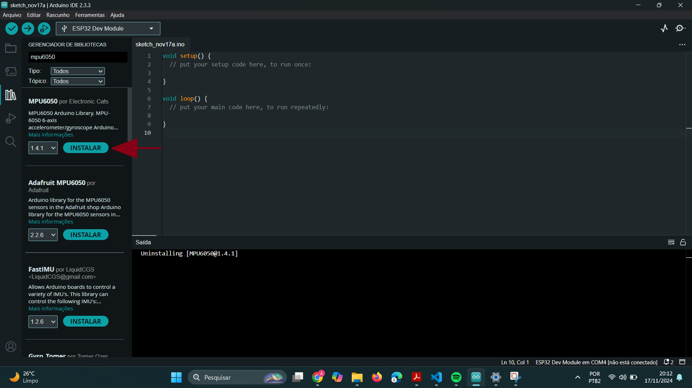
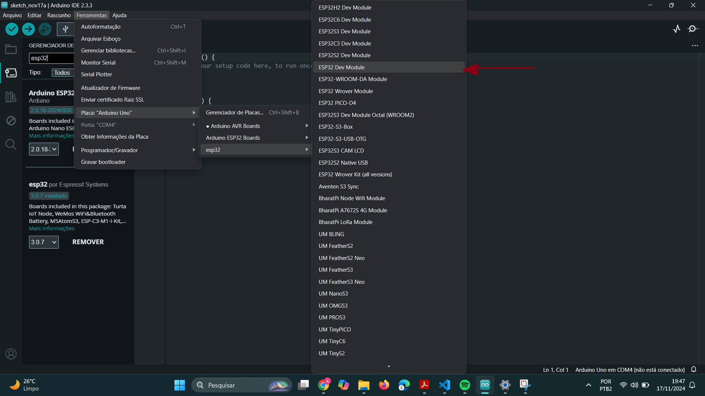
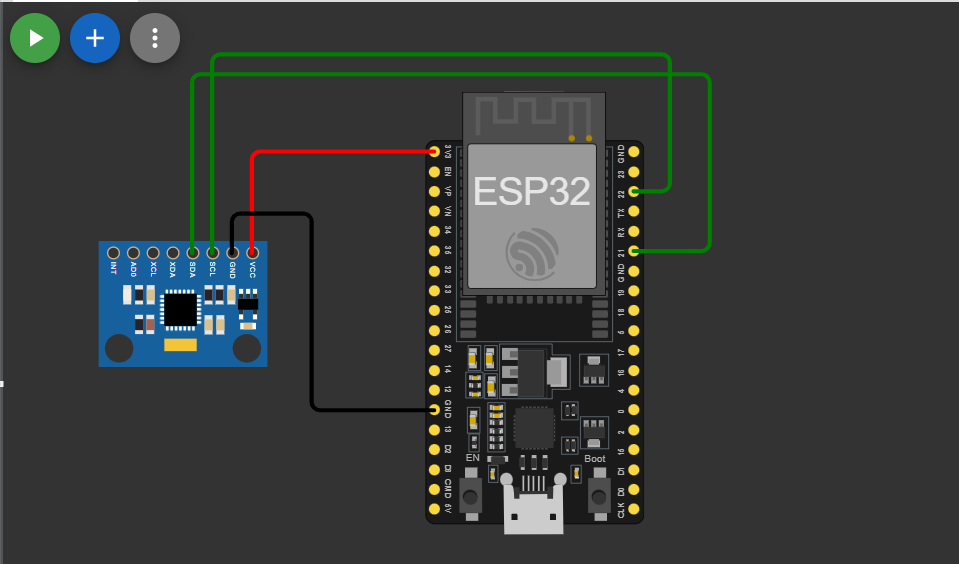

# Sistema de Monitoramento da Qualidade de Sono de Pacientes

**Descrição:** Tutorial para a criação de um sistema de monitoramento de movimentos durante o sono. Usando uma ESP32, um sensor de movimento(acelerômetro MPU6050) e jumpers, você poderá capturar dados que indicam se o sono foi tranquilo ou agitado. 

---

## Índice

1. [Introdução](#introdução)
2. [Requisitos](#requisitos)
3. [Configuração do Ambiente](#configuração-do-ambiente)
4. [Montagem do Circuito](#montagem-do-circuito)
5. [Programação](#programação)
6. [Teste e Validação](#teste-e-validação)
7. [Expansões e Melhorias](#expansões-e-melhorias)
8. [Referências](#referências)

---

## Introdução

Este projeto busca monitorar a qualidade do sono, visto que ela afeta diretamente a saúde física e mental dos indivíduos. Ao integrar ferramentas IoT mais sofisticadas ao projeto, é possível gerar análises mais completas dos dados capturados, identificar possíveis distúrbios que o paciente possa ter e promover uma melhor compreensão das necessidades do corpo em relação ao descanso.

---

## Requisitos

### Hardware

- **Placa**: ESP32
- **Sensores**: Sensor de Movimento (MPU6050)
- **Outros componentes**: Jumpers, protoboard(Opcional).

### Software

- **Linguagens**: C/C++ para ESP32
- **IDE**: Arduino IDE
- **Bibliotecas**: MPU6050 e Wire(Normalmente já vem instalada)

---

## Configuração do Ambiente

### Passo 1: Instalação do Software

- **Arduino IDE**: Por meio do link (https://www.arduino.cc/en/software) instale a IDE do Arduino. Após a instalação em Gerenciamento de Placas pesquise ESP32 e instale o item de mesmo nome. 

- **Bibliotecas**: No Gerenciador de bibliotecas, pesquise por MPU6050 e instale a primeira opção.

    


### Passo 2: Configuração das Placas

1. Conecte a ESP32 ao computador usando o cabo micro-USB.
2. No arduino IDE em Ferramentas > Placa > esp32, selecione ESP32 Dev Module.
    
    

3. Faça um processo parecido para selecionar a porta em Ferramentas > Portas e selecione a correspondente. 
 
---

## Montagem do Circuito

As principais ligações a serem feitas no circuito do sistema são:
1. Conectar o VCC do sensor com a alimentação 3.3V do ESP32;
2. Conectar o GND do sensor com a alimentação negativa da placa;
3. Conectar o SDA do sensor com a GPIO22 do ESP32;
4. Conectar o SCL do sensor com a GPIO21 do ESP32.

- A imagem a seguir ilustra melhor as ligações a serem feitas.
        
    

---

## Programação

### Passo 1: Configuração dos Sensores e Atuadores

Não é necessário especificar no código a configuração do sensor MPU6050, pois este usa o protocolo I2C e no ESP32 a biblioteca Wire que irá se encarrega de identificar os pinos padrões para o SDA e SCL.

```cpp
#include <Wire.h>
#include <MPU6050.h> 

MPU6050 mpu; //Cria um objeto que possibilita o uso de todas as funções e recursos da biblioteca MPU6050.
int movimento = 0; //Variável para monitorar o movimento.
int limiar = 3000; //Variável de referencia para detecatar movimentos bruscos. Um linear baixo significa mais sensibilidade aos movimentos.  

void setup() {
  Serial.begin(115200);
  //Inicaliza a biblioteca que verifica as portas GPIO22 E GPIO21
  Wire.begin();
  //Inializa o objeto mpu
  mpu.initialize();
  
  //Caso a biblioteca Wire identifique erro nas conexões com sensor MPU6050, retorna erro
  if (!mpu.testConnection()) {
    Serial.println("Erro ao conectar ao MPU6050");
    while (1);
  }
  
  Serial.println("Monitor de Sono Iniciado");
}
```

### Passo 2: Processamento e Lógica de Alerta

- Segunda parte do código

```cpp
void loop() {
  // Lê aceleração em X, Y e Z
  int16_t ax, ay, az;
  mpu.getAcceleration(&ax, &ay, &az);
  
  // Calcula o vetor total de movimento
  movimento = abs(ax) + abs(ay) + abs(az);
  
  // Verifica se excede o limiar
  if (movimento > limiar) {
    Serial.println("Movimento detectado!");
  } else {
    Serial.println("Sono tranquilo.");
  }
  
  delay(1000); // Ajuste conforme necessário
}
```

---

## Teste e Validação

Possíveis teste a serem feitos para garantir a funcionalidade do projeto:

1. **Testando Conexões**: Verifique se os jumpers estão corretamente conectados entre o MPU6050 e a ESP32. 
2. **Validação do Sensor**: Testar se os dados de aceleração e giroscópio estão sendo lidos corretamente, com pequenos movimentos.
3. **Validações Finais**: Teste com pessoas de diferentes pesos e estilos de sono para garantir que o sistema seja robusto em diferentes situações.

---

## Expansões e Melhorias

Sugestões para melhorar o projeto, como:

- Incorporação de outros sensore como o MAX30102, para monitoramento de frequência cardíaca e oxigenação do sangue.
- Integração com IA ou Machine Learning para criar modelos que aprendam e detecam padrões anormais associados a distúrbios do sono.
- Adicionar um microfone para capturar sons durante o sono, como roncos, que podem indicar apneia do sono.

---

## Referências

1. (https://circuitdigest.com/microcontroller-projects/mpu6050-gyro-sensor-interfacing-with-esp32-nodemcu-board)
2. (https://wokwi.com/projects/414860352606716929)
3. (https://www.unimedcampinas.com.br/blog/viver-com-saude/a-importancia-do-sono-de-qualidade-para-a-sua-vida#:~:text=Al%C3%A9m%20de%20relaxar%2C%20o%20sono,diminui%C3%A7%C3%A3o%20da%20capacidade%20de%20concentra%C3%A7%C3%A3o)
4. (https://github.com/ElectronicCats/mpu6050)

---