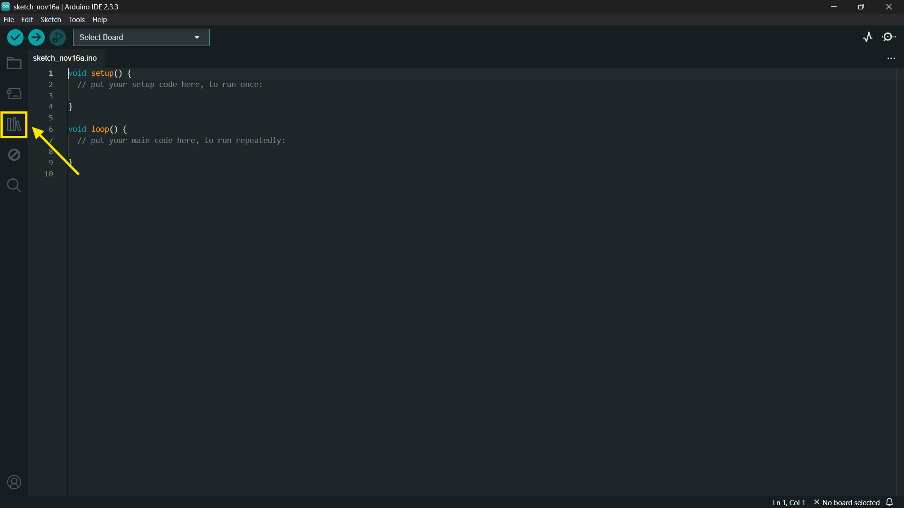
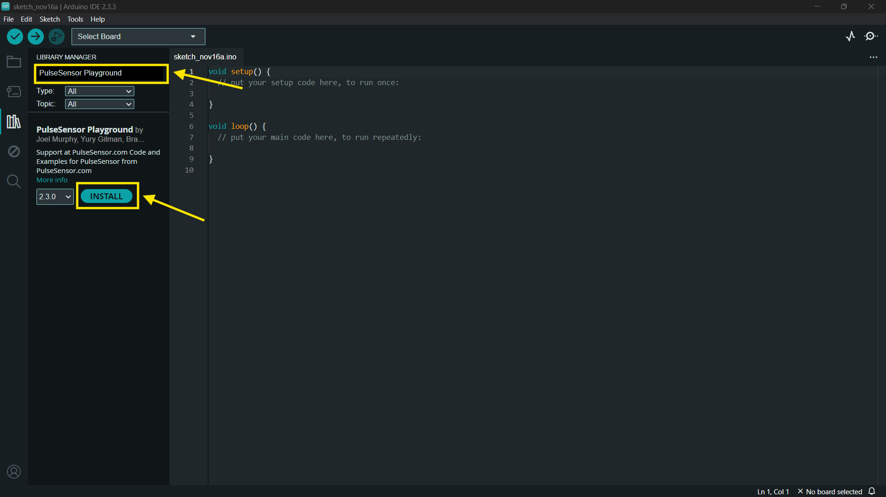
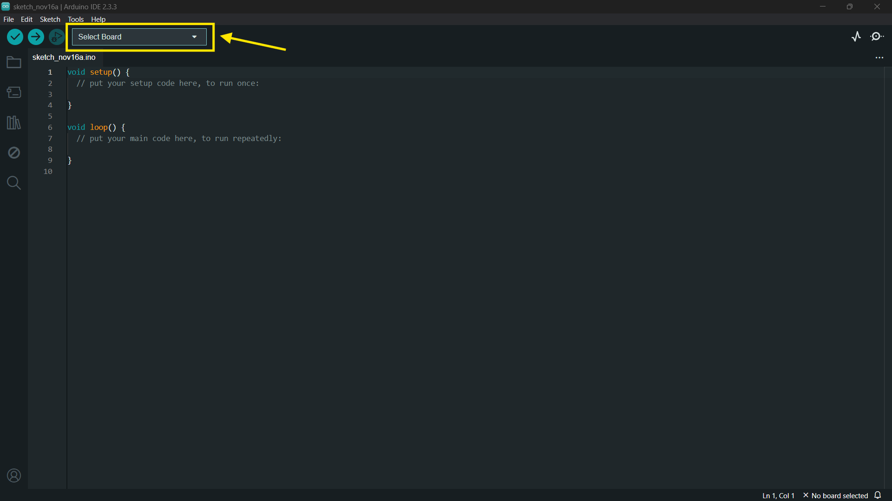
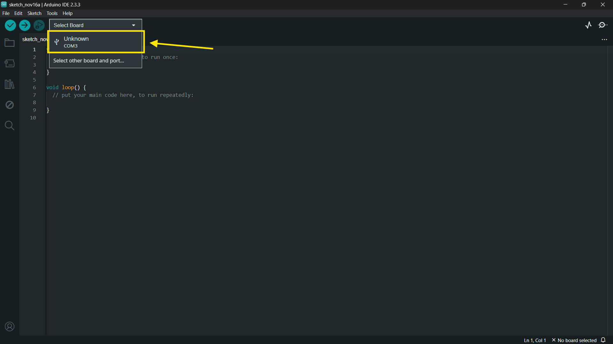
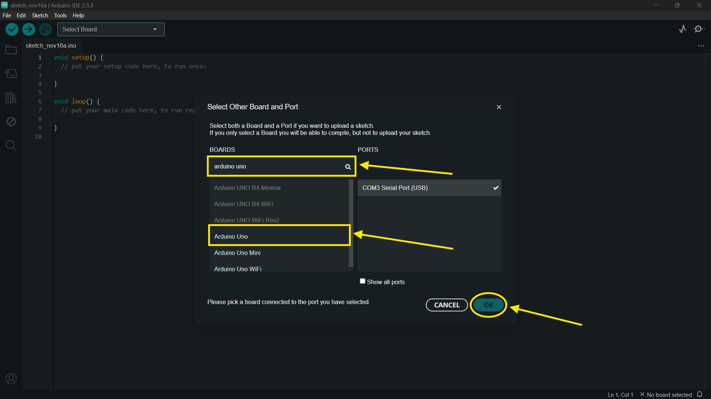
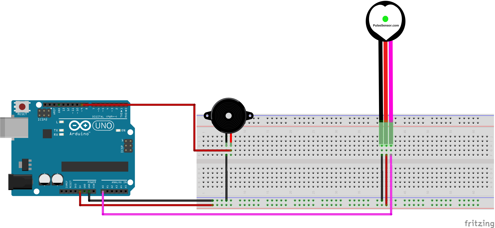

# Sistema de Monitoramento de Batimentos Cardíacos com Alerta Sonoro

**Descrição:** O tutorial ensinará como desenvolver um sistema simples para monitorar os batimentos cardíacos com alerta sonoro usando o Arduino, ideal para iniciantes visualizarem aplicações do Arduino ou similares na área da saúde.

---

## Índice

- [Sistema de Monitoramento de Batimentos Cardíacos com Alerta Sonoro](#sistema-de-monitoramento-de-batimentos-cardíacos-com-alerta-sonoro)
  - [Índice](#índice)
  - [Introdução](#introdução)
  - [Requisitos](#requisitos)
    - [Hardware](#hardware)
    - [Software](#software)
  - [Configuração do Ambiente](#configuração-do-ambiente)
    - [Passo 1: Instalação do Software](#passo-1-instalação-do-software)
    - [Passo 2: Configuração das Placas](#passo-2-configuração-das-placas)
  - [Montagem do Circuito](#montagem-do-circuito)
  - [Programação](#programação)
    - [Passo 1: Configuração dos Sensores e Atuadores](#passo-1-configuração-dos-sensores-e-atuadores)
    - [Passo 2: Processamento e Lógica de Alerta](#passo-2-processamento-e-lógica-de-alerta)
  - [Teste e Validação](#teste-e-validação)
  - [Expansões e Melhorias](#expansões-e-melhorias)
  - [Referências](#referências)

---

## Introdução

Este circuito tem como finalidade simular uma situação recorrente hospitais que é a variação da frenquência cardíaca dos pacientes, onde se os valores dos batimentos por minuto (BPM) chegarem a determinados valores críticos enviasse informações como um alerta sono, isso pode ser facilmente escalável para o envio de notificações diretamente para os médicos e enfermeiros responsáveis, mas o intuito deste tutorial é a introdução de conhecimentos básicos a iniciantes e sua ambientação com as ferramentas, então será trabalhado um circuito mais simples.

---

## Requisitos

### Hardware

- **Placa**: Arduino Uno
- **Sensores**: Sensor de batimentos cardíacos(Sensor de Pulso)
- **Atuadores**: Buzzer(emissão de alerta sonoro)
- **Outros componentes**: Protoboard, 1 resistor de 1kΩ(depende do modelo do buzzer) e 5 jumpers

### Software

- **Linguagens**: C/C++ para Arduino.
- **IDE**: Arduino IDE.
- **Bibliotecas**:`PulseSensor Playground`

---

## Configuração do Ambiente

### Passo 1: Instalação do Software

- **Arduino IDE**: Faça o download do software Arduino IDE que no tutorial a partir do link https://www.arduino.cc/en/software.
  
- **Bibliotecas**: Para instalação da biblioteca necessária siga as etapas abaixo:
1. Após realizar a instalação do Arduino IDE procure pelo icone que são vários livros um ao lado do outro:

2. Agora na área de texto digite "PulseSensor Playground" e clique em "INSTALL" para instalar a única opção disponível.


### Passo 2: Configuração das Placas

- **Arduino**: Passo a passo para configuração da placa e porta que será utilizada.
1. Conecte o arduino ao seu conputador utilizando o cabo USB.
2. Clique na parte destacada:

3. Após clicar em "Select Board" clique em:

4. Na área de texto pesquise por "arduino uno", clique na opção de mesmo nome e no final clique em "OK" para confirmar:


---

## Montagem do Circuito

Abaixo segue as instruções para montagem:
1. Preparação da Protoboard e Conexão do GND
- Conecte o pino GND do Arduino à linha de alimentação negativa (linha preta) da protoboard.
2. Conexão da Linha Positiva da Protoboard
- Conecte o pino 5V do Arduino à linha positiva (linha vermelha) da protoboard.
3. Conexão do Sensor de Batimentos Cardíacos
- GND do sensor(fio preto) conecta na linha negativa (linha preta) da protoboard a que tá conectada o GND do arduino.
- VCC do sensor(fio vermelho) à linha positiva (linha vermelha) da protoboard.
- Sinal do sensor ao pino A0 do Arduino (entrada analógica).
4. Conexão do Buzzer
- Conecte o pino positivo (normalmente marcado com um sinal "+" ou na cor vermelha) do buzzer a um pino digital do Arduino o pino 9.
- Caso o modelo necessite coloque um resistor de 1kΩ a linha do pino positivo do buzzer e na outra ponta use para fazer a ligação com a pino 9.
- Conecte o pino negativo (normalmente marcado com um sinal "-" ou na cor preta) do buzzer à linha negativa (linha preta) da protoboard, que está conectada ao GND do Arduino.

> **Dica**: Tenha bastante atenção ao conectar as portas, ao fazer os caminhos dos cabos, revise todas as conexões e recomendo não fazer alterações com o arduino ligado ao computador.

Abaixo a imagem com o circuito totalmente montado:


---

## Programação

### Passo 1: Configuração dos Sensores e Atuadores

Forneça o código para a configuração dos sensores. Por exemplo, para medir temperatura e batimentos cardíacos:

**Exemplo em C para ESP32:**

```cpp
#include <DHT.h>

#define DHTPIN 2     // Pino do sensor DHT
#define DHTTYPE DHT11 

DHT dht(DHTPIN, DHTTYPE);

void setup() {
  Serial.begin(9600);
  dht.begin();
}

void loop() {
  float temp = dht.readTemperature();
  Serial.println(temp);
  delay(2000);
}
```

**Exemplo em Python para Raspberry Pi:**

```python
import Adafruit_DHT

sensor = Adafruit_DHT.DHT11
pin = 4  # Pino GPIO

humidity, temperature = Adafruit_DHT.read_retry(sensor, pin)
print(f"Temperatura: {temperature}ºC")
```

### Passo 2: Processamento e Lógica de Alerta

Adicione a lógica para processar os dados e acionar atuadores, como LEDs ou buzzer, caso as leituras excedam um determinado limite.

---

## Teste e Validação

Descreva os testes para validar cada parte do projeto:

1. **Testando Sensores**: Verifique se as leituras são consistentes e corretas.
2. **Validação dos Atuadores**: Confirme que os atuadores funcionam corretamente.
3. **Monitoramento em Tempo Real**: Teste o sistema completo em condições simuladas para garantir que funciona conforme o esperado.

---

## Expansões e Melhorias

Sugestões para melhorar o projeto, como:

- Adicionar comunicação Wi-Fi (ESP32) para enviar dados para uma nuvem.
- Integrar um banco de dados para registro das leituras.
- Conectar-se a uma aplicação móvel para visualização remota.

---

## Referências

Liste todas as referências e links úteis para guias, bibliotecas, e materiais adicionais que ajudem a complementar o tutorial.

---