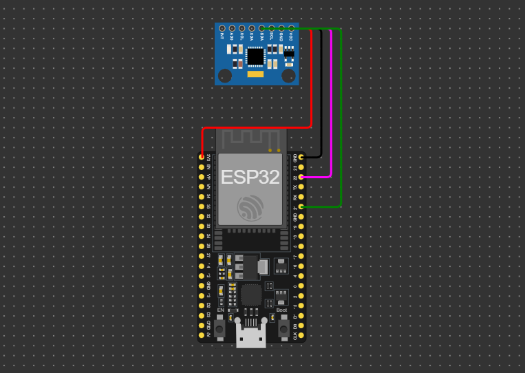

# Sistema de Detecção de Quedas com Alerta para Pessoas Idosas

**Descrição:** Este tutorial apresenta como desenvolver um sistema simples para detectar quedas utilizando o ESP32. Ele pode ser utilizado para monitoramento de idosos, enviando alertas para cuidadores ou enfermeiros.

---

## Índice

- [Sistema de Detecção de Quedas com Alerta para Pessoas Idosas](#sistema-de-detecção-de-quedas-com-alerta-para-pessoas-idosas)
  - [Índice](#índice)
  - [Introdução](#introdução)
  - [Requisitos](#requisitos)
    - [Hardware](#hardware)
    - [Software](#software)
  - [Configuração do Ambiente](#configuração-do-ambiente)
    - [Passo 1: Instalação do Software](#passo-1-instalação-do-software)
    - [Passo 2: Configuração das Placas](#passo-2-configuração-das-placas)
  - [Montagem do Circuito](#montagem-do-circuito)
  - [Programação](#programação)
    - [Passo 1: Configuração do Sensor e Lógica de Queda](#passo-1-configuração-do-sensor-e-lógica-de-queda)
    - [Passo 2: Configuração do Alerta MQTT](#passo-2-configuração-do-alerta-mqtt)
    - [Código Completo](#código-completo)
  - [Teste e Validação](#teste-e-validação)
  - [Expansões e Melhorias](#expansões-e-melhorias)
  - [Referências](#referências)

---

## Introdução

Este projeto visa desenvolver um sistema de detecção de quedas para pessoas idosas, utilizando um acelerômetro conectado ao ESP32. O sistema é projetado para monitorar a aceleração e identificar padrões que indicam quedas. Quando uma queda é detectada, um alerta é enviado via protocolo MQTT, permitindo comunicação com dispositivos móveis ou sistemas centralizados. Essa solução tem como objetivo principal garantir mais segurança e autonomia para idosos, facilitando uma resposta rápida em situações de emergência.

---

## Requisitos

### Hardware

- **Placa:** ESP32.
- **Sensor:** MPU6050 (Acelerômetro e Giroscópio).
- **Outros componentes:** Protoboard, jumpers.

### Software

- **Linguagem:** C++ para Arduino.
- **IDE:** Arduino IDE.
- **Bibliotecas:** `Wire`, `Adafruit_MPU6050`, `WiFi`, `PubSubClient`.

---

## Configuração do Ambiente

### Passo 1: Instalação do Software

- **Arduino IDE**: Faça o download do software Arduino IDE que no tutorial a partir do link https://www.arduino.cc/en/software.
  
- **Bibliotecas**: Para instalação da biblioteca necessária siga as etapas abaixo:
  1. Abra o Arduino IDE e vá para **Sketch > Include Library > Manage Libraries...**.
  2. Instale as bibliotecas `Adafruit_MPU6050`, `WiFi` e `PubSubClient`.

### Passo 2: Configuração das Placas

1. Conecte o ESP32 ao computador usando um cabo USB.
2. No Arduino IDE, selecione a placa ESP32 e a porta correta em **Tools > Board** e **Tools > Port**.
3. Certifique-se de que o driver da placa esteja instalado.

---

## Montagem do Circuito

1. **Conexão do Sensor MPU6050:**
   - VCC do MPU6050 ao pino 3.3V do ESP32.
   - GND do MPU6050 ao GND do ESP32.
   - SDA do MPU6050 ao pino D21 (SDA do ESP32).
   - SCL do MPU6050 ao pino D22 (SCL do ESP32).

> **Dica:** Verifique as especificações do seu módulo MPU6050 para confirmar os pinos de conexão.

Abaixo a imagem com o circuito totalmente montado:


---

## Programação

### Passo 1: Configuração do Sensor e Lógica de Queda

Configuração inicial do sensor e detecção de quedas baseando-se na magnitude da aceleração:

```cpp
#include <Wire.h>
#include <Adafruit_MPU6050.h>
#include <Adafruit_Sensor.h>

Adafruit_MPU6050 mpu;

void setup() {
  Serial.begin(115200);

  if (!mpu.begin()) {
    Serial.println("Falha ao inicializar o sensor MPU6050");
    while (1);
  }

  mpu.setAccelerometerRange(MPU6050_RANGE_8_G);
  mpu.setGyroRange(MPU6050_RANGE_500_DEG);
}

void loop() {
  sensors_event_t a, g, temp;
  mpu.getEvent(&a, &g, &temp);

  float magnitude = sqrt(a.acceleration.x * a.acceleration.x +
                         a.acceleration.y * a.acceleration.y +
                         a.acceleration.z * a.acceleration.z);

  if (magnitude > 2.5) { // Threshold para detectar queda
    Serial.println("Queda detectada!");
    enviarAlerta();
  }

  delay(100);
}
```

### Passo 2: Configuração do Alerta MQTT

Código para envio de alerta via MQTT:

```cpp
#include <WiFi.h>
#include <PubSubClient.h>

const char* ssid = "SEU_SSID";
const char* password = "SUA_SENHA";
const char* mqttServer = "BROKER_MQTT";
const int mqttPort = 1883;
const char* mqttUser = "USUARIO";
const char* mqttPassword = "SENHA";

WiFiClient espClient;
PubSubClient client(espClient);

void conectarWiFi() {
  WiFi.begin(ssid, password);
  while (WiFi.status() != WL_CONNECTED) {
    delay(1000);
    Serial.println("Conectando ao WiFi...");
  }
  Serial.println("WiFi conectado");
}

void conectarMQTT() {
  client.setServer(mqttServer, mqttPort);
  while (!client.connected()) {
    Serial.println("Conectando ao broker MQTT...");
    if (client.connect("ESP32Client", mqttUser, mqttPassword)) {
      Serial.println("Conectado ao MQTT");
    } else {
      delay(2000);
    }
  }
}

void enviarAlerta() {
  if (!client.connected()) {
    conectarMQTT();
  }
  client.publish("alerta/queda", "Queda detectada!" );
}

void setup() {
  Serial.begin(115200);
  conectarWiFi();
  conectarMQTT();
}
```

### Código Completo

```cpp
#include <Wire.h>
#include <Adafruit_MPU6050.h>
#include <Adafruit_Sensor.h>
#include <WiFi.h>
#include <PubSubClient.h>

Adafruit_MPU6050 mpu;

const char* ssid = "SEU_SSID";
const char* password = "SUA_SENHA";
const char* mqttServer = "BROKER_MQTT";
const int mqttPort = 1883;
const char* mqttUser = "USUARIO";
const char* mqttPassword = "SENHA";

WiFiClient espClient;
PubSubClient client(espClient);

void conectarWiFi() {
  WiFi.begin(ssid, password);
  while (WiFi.status() != WL_CONNECTED) {
    delay(1000);
    Serial.println("Conectando ao WiFi...");
  }
  Serial.println("WiFi conectado");
}

void conectarMQTT() {
  client.setServer(mqttServer, mqttPort);
  while (!client.connected()) {
    Serial.println("Conectando ao broker MQTT...");
    if (client.connect("ESP32Client", mqttUser, mqttPassword)) {
      Serial.println("Conectado ao MQTT");
    } else {
      delay(2000);
    }
  }
}

void enviarAlerta() {
  if (!client.connected()) {
    conectarMQTT();
  }
  client.publish("alerta/queda", "Queda detectada!" );
}

void setup() {
  Serial.begin(115200);

  if (!mpu.begin()) {
    Serial.println("Falha ao inicializar o sensor MPU6050");
    while (1);
  }

  conectarWiFi();
  conectarMQTT();

  mpu.setAccelerometerRange(MPU6050_RANGE_8_G);
}

void loop() {
  sensors_event_t a, g, temp;
  mpu.getEvent(&a, &g, &temp);

  float magnitude = sqrt(a.acceleration.x * a.acceleration.x +
                         a.acceleration.y * a.acceleration.y +
                         a.acceleration.z * a.acceleration.z);

  if (magnitude > 2.5) {
    Serial.println("Queda detectada!");
    enviarAlerta();
  }

  delay(100);
}
```

---

## Teste e Validação

Descreva os testes para validar cada parte do projeto:

1. **Testando o Acelerômetro**: Conecte o acelerômetro ao ESP32 e use o Monitor Serial para verificar se os valores de aceleração (nos eixos X, Y e Z) estão sendo lidos corretamente. Certifique-se de que os dados estão consistentes e dentro do esperado durante movimentos simulados.
2. **Simulação de Quedas**: Realize movimentos rápidos e bruscos que simulem quedas e observe se o sistema identifica corretamente esses eventos. Verifique se os alertas são acionados com precisão.
3. **Validação da Comunicação MQTT**: Configure um cliente MQTT (como um aplicativo em um smartphone ou software de monitoramento). Certifique-se de que os alertas de queda estão sendo enviados corretamente para o servidor MQTT e que são recebidos no dispositivo conectado.
---

## Expansões e Melhorias

Sugestões para melhorar o projeto, como:

- Notificação para Médicos e Enfermeiros: Enviar alertas diretamente para dispositivos móveis dos responsáveis.
- Buzzer Remoto: Adicionar um buzzer em ambientes afastados para alertar médicos quando longe do paciente.
- Interface Gráfica: Desenvolver uma aplicação simples para visualização, análise de dados e notificar as alterações.

---

## Referências

1. Link para simulação no WORKI: https://wokwi.com/projects/417115872417508353
2. Documentação do MPU6050(Acelerômetro e Giroscópio): https://invensense.tdk.com/products/motion-tracking/6-axis/mpu-6050/
3. Biblioteca Wire (I2C): https://www.arduino.cc/en/Reference/Wire

4. Biblioteca Adafruit_MPU6050: https://github.com/adafruit/Adafruit_MPU6050
5. Biblioteca WiFi: https://www.arduino.cc/en/Reference/WiFi

6. Biblioteca PubSubClient (MQTT): https://pubsubclient.knolleary.net/