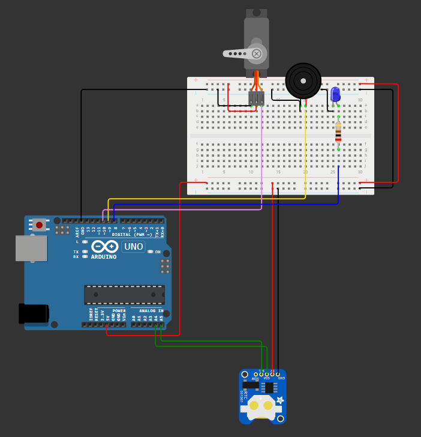

# Monitoramento do Paciente

**Descrição:** Nesse tutorial, vamos aprender a montar um sistema de lembrete de medicação automatizado utilizando o Arduino UNO. Esse sistema é úteis para auxiliar pacientes a lembrarem de tomar seus remédios nos horários corretos, emitindo um alerta sonoro e visual, podendo até mesmo acionar um pequeno motor para abrir uma gaveta de comprimidos.

---

## Índice

1. [Introdução](#introdução)
2. [Requisitos](#requisitos)
3. [Configuração do Ambiente](#configuração-do-ambiente)
4. [Montagem do Circuito](#montagem-do-circuito)
5. [Programação](#programação)
6. [Teste e Validação](#teste-e-validação)
7. [Expansões e Melhorias](#expansões-e-melhorias)
8. [Referências](#referências)

---

## Introdução

Esse projeto foi projetado para ajudar pacientes a tomarem suas medicações nos horários corretos. Utilizando um Arduino, um módulo RTC (Relógio de Tempo Real) e alguns componentes adicionais, será possível criar um sistema que emita alertas sonoros e visuais nos horários definidos.

---

## Requisitos

### Hardware

- **Placa**: Arduino UNO.
- **Módulo RTC**: DS1307 ou DS3231.
- **Atuadores**: Buzzer e LED.
- **Outros componentes**: Resistor (220Ω), cabos de ligação, cabo USB, opcionalmente um servo motor.

### Software

- **Linguagens**: C/C++ para Arduino.
- **IDE**: Arduino IDE, Wokwi.
- **Bibliotecas**: Wire.h e RTClib.h (para RTC).

---

## Configuração do Ambiente

### Passo 1: Instalação do Software

- **Arduino IDE**: Por meio do link (https://www.arduino.cc/en/software), é possível fazer o download do software que será utilizado para comunicação direta com o Arduino.

### Passo 2: Instalação das Bibliotecas

• Instale as bibliotecas necessárias:
    1. Abra a Arduino IDE.
    
    2. Clique em Sketch > Incluir Biblioteca > Gerenciar Bibliotecas.
    
    3. Procure por RTClib e clique em instalar.
    
    4. Procure por Servo e clique em instalar.
    

## Montagem do Circuito
### Diagrama
**RTC**: Conecte SDA ao pino A4 e SCL ao pino A5 do Arduino. Alimente o RTC com 5V e GND.

**Buzzer**: Conecte o terminal positivo a um resistor (220Ω) e depois ao pino digital 9. O terminal negativo vai ao GND.

**LED**: Conecte o anodo (à esquerda) ao pino digital 8 através de um resistor (220Ω). O catodo (à direita) vai ao GND.

**Servo Motor (opcional)**: Conecte o fio de sinal ao pino digital 10, o fio de alimentação ao 5V e o GND ao GND do Arduino.

### Pinagem Resumida
• RTC:
  • SDA -> A4
  • SCL -> A5
  • VCC -> 5V
  • GND -> GND
Buzzer -> Pino 9
LED -> Pino 8
Servo Motor (opcional) -> Pino 10

### Imagem Representativa

---

## Programação

### Configuração do RTC e Alerta
```cpp
#include <Wire.h>
#include <RTClib.h>
#include <Servo.h> // Inclua se usar o motor

RTC_DS1307 rtc;
Servo gaveta; // Crie o objeto para o servo

const int buzzerPin = 9;
const int ledPin = 8;
const int servoPin = 10; // Pino do servo

void setup() {
  pinMode(buzzerPin, OUTPUT);
  pinMode(ledPin, OUTPUT);
  gaveta.attach(servoPin); // Inicializa o servo

  Serial.begin(9600);

  if (!rtc.begin()) {
    Serial.println("RTC não encontrado!");
    while (1);
  }

  if (!rtc.isrunning()) {
    Serial.println("RTC parado! Ajustando hora...");
    rtc.adjust(DateTime(F(__DATE__), F(__TIME__)));
  }
}

void loop() {
  DateTime agora = rtc.now();

  // Ajuste o horário do alarme (exemplo: 08:15:30)
  if (agora.hour() == 8 && agora.minute() == 15 && agora.second() == 30) {
    digitalWrite(ledPin, HIGH);
    tone(buzzerPin, 1000); // Frequência do buzzer
    delay(5000); // Alerta por 5 segundos
    digitalWrite(ledPin, LOW);
    noTone(buzzerPin);

    // Abra a gaveta (opcional)
    gaveta.write(90); // Ajuste o ângulo conforme necessário
    delay(5000);
    gaveta.write(0); // Feche a gaveta
  }

  delay(1000); // Atualização a cada segundo
}
```

## Teste e Validação:

1. **Testando o RTC**: Verificado que a hora do RTC está correta, imprimindo-a no monitor serial.
2. **Alerta do Buzzer e LED**: Feitos ajustes para o horário do teste (0h 21min e 10 secs), foi possível ver o led ligando e o buzzer se ativando.
    **Led e Buzzer ativos**:
    
3. **Servo Motor (opcional)**: Após o led e o buzzer desligarem, o servo se mexeu.
    **Servo movido**:
    

## Expansões e Melhorias

• **Integração com Wi-Fi**: Enviar lembretes para um smartphone ou tablet.
• **Display LCD**: Mostrar o horário e informações do alarme em tempo real.
• **Mais Alarmes**: Permitir a configuração de múltiplos horários de medicação.

## Referências

• [Arduino RTC Documentation (Wire Library):](https://chatgpt.com/c/674bee30-106c-8009-b324-ecb237cd6ef7?model=o1)
• [Servo Motor Basics (Exemplo da Biblioteca Servo):](https://chatgpt.com/c/674bee30-106c-8009-b324-ecb237cd6ef7?model=o1)